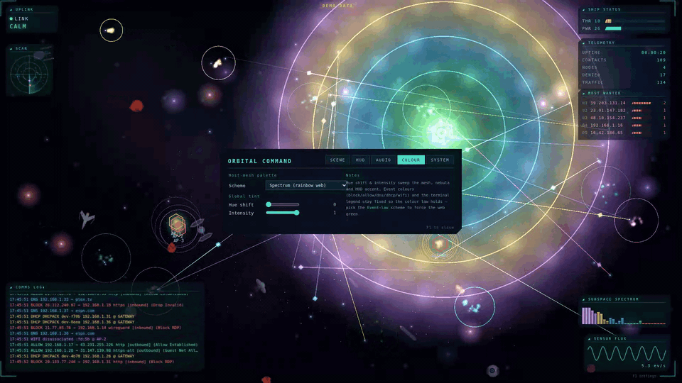
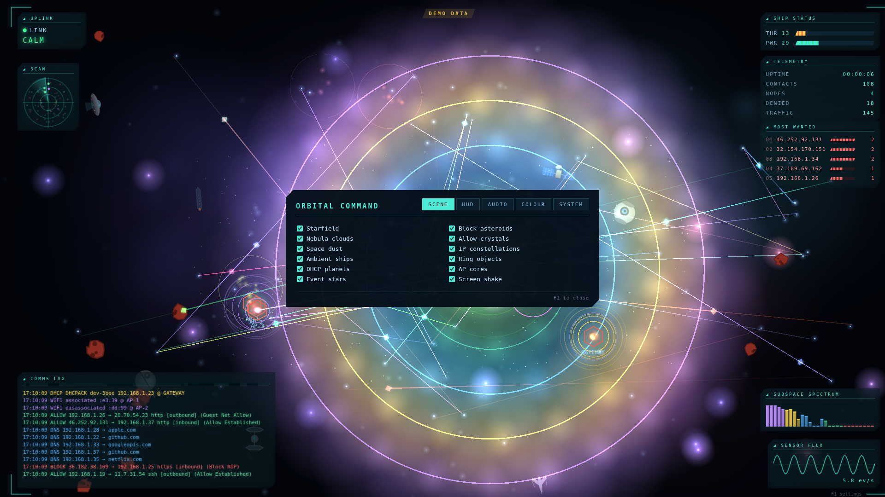
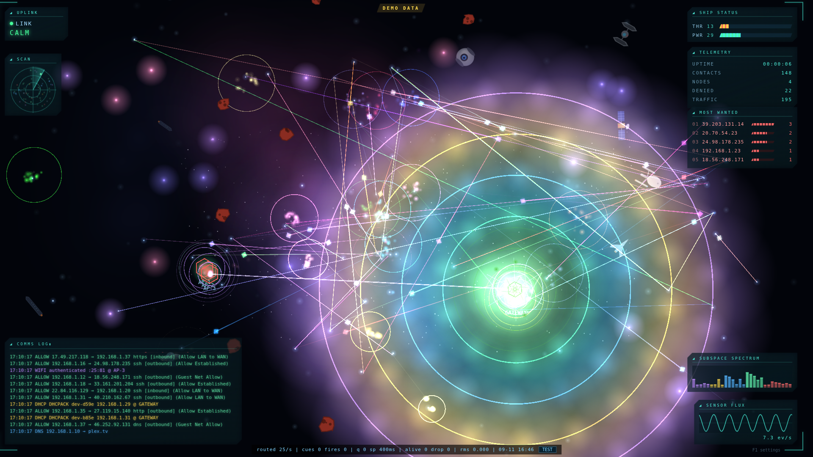

# pewpew — Orbital Command

**Your UniFi network as a living space battle.** A real-time, browser-based
"orbital command" visualizer + generative soundtrack for UniFi gateway/AP
syslog. Every firewall hit, DNS lookup, DHCP lease and Wi-Fi (dis)connect
becomes something on screen — lasers, crystals, incoming asteroids blasted by
defensive lasers — and everything you hear is synthesized live in the browser
from *your* traffic. No database, no cloud, no recordings: pure eye candy that
never touches the network itself.



Full-quality 60s showreel: [docs/demo.mp4](docs/demo.mp4) ·
Screenshots: [hero](docs/hero.png) ·
[storm](docs/storm.png) ·
[settings](docs/panel.png) ·
[debug](docs/debug.png)

## See it right now (no hardware needed)

```bash
cd web && npm install && npm run dev
open http://localhost:5173/?demo=1&showreel=1
```

`?demo=1` runs a fully synthetic event generator (fake IPs/MACs/hosts —
nothing real), `showreel=1` scripts a 60s arc: calm cruise → traffic build →
**hurricane** → cooldown. Click once to wake the audio engine (browser autoplay
policy). See [URL params](#url-params) for dialing the intensity by hand.

## How it works

```
UDM/UDR ──syslog UDP:5514──► relay (Python) ──JSON over WebSocket──► browser
                                │                                      :8080
                                └── also serves the built PixiJS front-end
```

- `relay/` — Python 3.10+ aiohttp server. Parses syslog with the vendored
  [UniFi-Insights-Plus](https://github.com/jmasarweh/UniFi-Insights-Plus)
  parsers (DB/policy deps stripped), broadcasts every event to all browsers,
  replays the last 500 events to each new tab. Regex drop-list filters the
  known UDM/AP log spam. `--demo` generates fake events server-side too.
- `web/` — Vite + TypeScript + [PixiJS v8](https://pixijs.com/). Everything
  (starfield, ships, lasers, particles, the entire audio synth) is generated
  procedurally — zero image or audio assets.
- `deploy/` — systemd unit + kiosk autostart entry (built to run fullscreen
  on a Raspberry Pi, but any Chromium/Chrome/Firefox will do).

## Run against your own network

1. Start the relay:

   ```bash
   cd relay && python3 -m venv .venv && .venv/bin/pip install -r requirements.txt
   .venv/bin/python pewpew_relay.py
   ```

2. UniFi OS console: **Settings → Advanced → Remote Syslog → host = this
   machine, port = 5514**. Enable logging on the firewall zones/rules you
   want to see.

3. Open `http://<relay-host>:8080`. Adjust `wan_interfaces` in
   `relay/relay.yaml` if inbound/outbound classification looks wrong
   (`ppp0` for DSL, `eth9/eth10` on some setups — see `/healthz`).

4. Production build: `cd web && npm run build` — the relay serves `dist/`
   automatically (with `Cache-Control: no-cache`, so refreshes always get the
   current build).

## The visual language

Colors of every effect match the comms-log lines verbatim:

| Event    | Color      | On screen |
|----------|------------|-----------|
| allow    | green      | crystals core↔device + star-to-star links, inner ring |
| block    | red        | inbound asteroid → station laser intercept, shake + flash |
| dns      | blue       | blue laser client→station ("the resolver is you"), 2nd ring |
| dhcp     | yellow     | station→AP yellow laser, 3rd ring |
| wifi     | purple     | AP↔station links + crystals, 4th ring |
| system   | grey       | grey shockwave from the station |

Traffic volume drives weather: **STORM** at ≥300 events/30s, **HURRICANE** at
≥1200 — the whole scene reddens, debris fields spawn, and the HUD goes amber.
IPs you talk to a lot grow into constellations; blocked destinations rack up
on the **MOST WANTED** board. The fleet drifting through the scene is a
hand-drawn (procedurally generated) honor squad.

## The audio engine

All sound is synthesized in the browser with the WebAudio API — there is no
audio file anywhere in this repo. Think of it as a small band that listens to
your network:

- **Generative set list** — a 4-song bank of distinct melodies (arpeggios,
  riffs, cascades, wanderings) rotated every 75–165s, each with its own bass
  groove, lead timbre and register. Mutations and key slides evolve each song
  in between.
- **Song structure** — the band moves through intro / verse / chorus / bridge
  / outro, driven by how heavy your traffic is. Block *pressure* (ratio of
  denied traffic) builds tension; a lull after a storm resolves it.
- **Device voices** — every MAC/IP gets a hash-derived musical identity, so
  your laptop plays "its" notes; overly chatty devices get fame-limited.
- **Additive layers** (F1) — three sound sources you mix in and out, they sum:
  **Melody** (the generative band), **Devices** (gated per-event hits — block
  kick, DNS sparkle, WiFi glide, DHCP chord, allow data-tick — plus the per-host
  identity notes), and **Noise** (a chaos texture fired 1:1 on raw events).
- **Volume vs gate** (F1) — every event type has its own *volume* (how loud)
  and its own *gate* (how often it passes, 0 = choked off → 1 = every hit).
  The **Noise gate** replaces the old NOISE MODE: 0 is silent, 1 is full chaos
  (every raw event, no dedupe, scheduled sample-accurately through a pacing
  queue so bursts stay audible).
- Master volume, reverb, echo, a music-bed-vs-hits balance, and a device-voice
  mix — all in F1.

## F1 settings panel

Press **F1** for a tabbed control surface — **Scene / HUD / Audio / Colour /
System**. Everything is live and persists to localStorage: scene layers and HUD
panels; the audio mix (additive Melody / Devices / Noise layers, per-event
volume *and* gate sliders, reverb, echo, music-bed balance); the host-mesh
colour scheme (spectrum / event-law / mono / warm / cool) with a global
hue-shift & intensity knob that sweeps the mesh, nebula and HUD accent; plus
the particle budget, simulation speed and a reset-to-defaults.



## URL params

| Param | Effect |
|-------|--------|
| `?demo=1` | synthetic event generator, no relay needed |
| `?demo=1&showreel=1` | scripted 60s calm→build→hurricane→cooldown arc, looping |
| `?demo=1&rate=40` | demo at ~40 events/sec |
| `?demo=1&rate=40&block=65` | …with 65% of firewall hits blocked |
| `?hosts=Router,Kitchen-AP` | demo hostnames |
| `?debug=1` | perf/audio overlay (events/s, scheduler queue, voices alive, RMS) |



## Health & diagnostics

- `GET /healthz` — per-host syslog line counters, WS clients, event counters
- `GET /drops` — which drop-pattern regexes are catching what
- APs/gateway stop logging for 1–3 minutes after a relay restart — that's the
  UniFi log-forwarder's backoff, it reconnects itself.

## Privacy

- Everything runs on your LAN. No outbound connections, no telemetry,
  no analytics, no accounts.
- Syslog is parsed in RAM and fanned out over WebSocket; nothing is written
  to disk. Settings live in your browser's localStorage.
- Demo mode generates fake IPs/MACs/hostnames — safe to screenshot and share.

## Troubleshooting

- **No sound** — browsers require a click/keypress before audio can start.
  One click, then the engine wakes up.
- **Everything looks soft/wrong after an update** — hard-refresh (Ctrl+Shift+R);
  the relay sends no-cache headers, but be paranoid.
- **Wrong direction classification** — fix `wan_interfaces` in `relay.yaml`.
- **Weak GPU** — lower the particle budget in F1, turn off nebula/dust.
- **Windows LAN IP changed and the viewer is blank** — it's pointing at the
  old relay IP; open the new one.

## Deploying (Raspberry Pi kiosk)

```bash
sudo cp deploy/pewpew-relay.service /etc/systemd/system/   # adjust paths/user
sudo systemctl enable --now pewpew-relay
cp deploy/pewpew-kiosk.desktop ~/.config/autostart/        # fullscreen chromium
```

## Credits

- Syslog parsing: vendored from
  [UniFi-Insights-Plus](https://github.com/jmasarweh/UniFi-Insights-Plus)
  (MIT), stripped of database dependencies.
- [PixiJS v8](https://pixijs.com/) for the renderer.
- Every texture, sound and melody: generated in code.

## License

[MIT](LICENSE)
