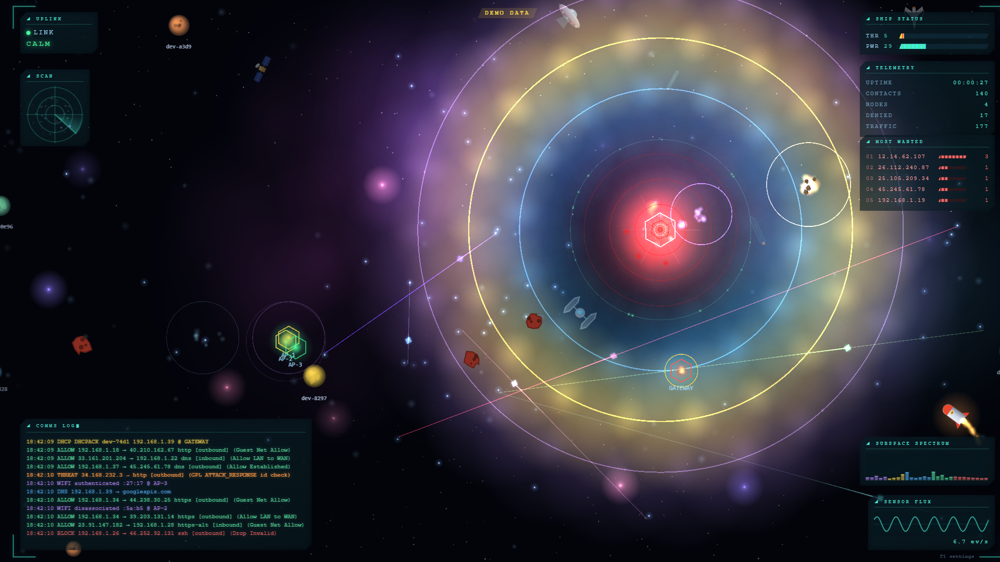
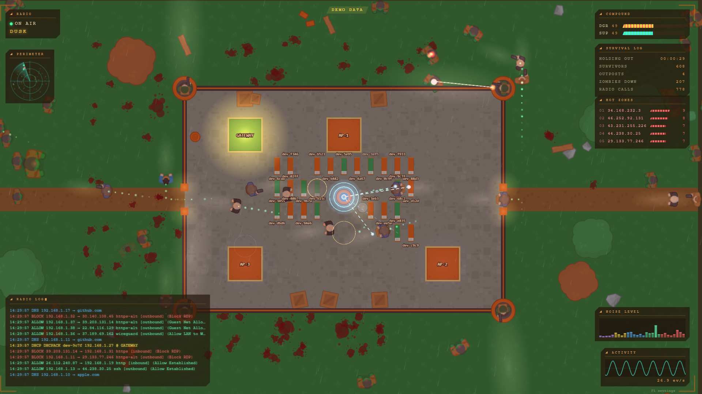
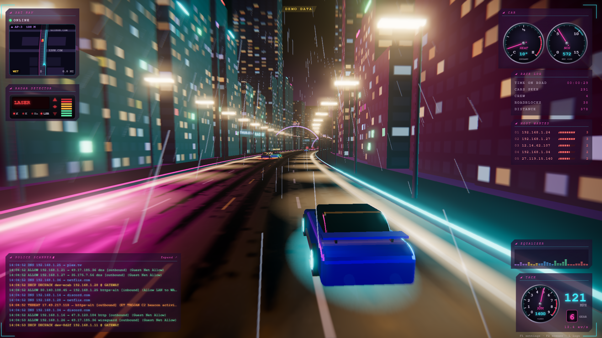
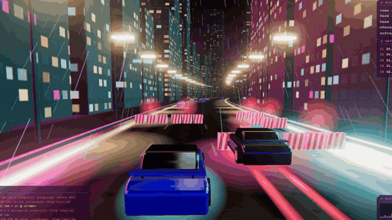
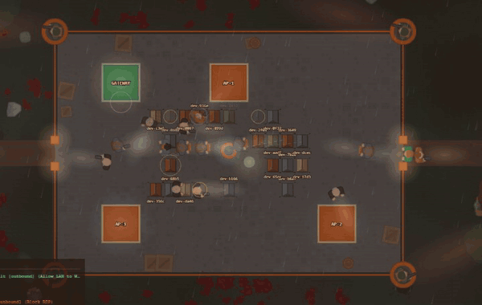
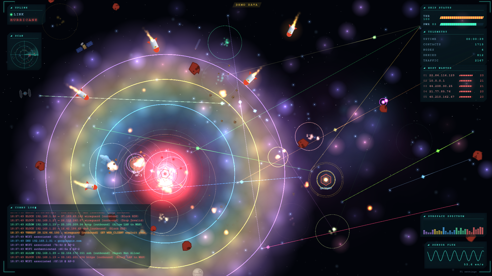
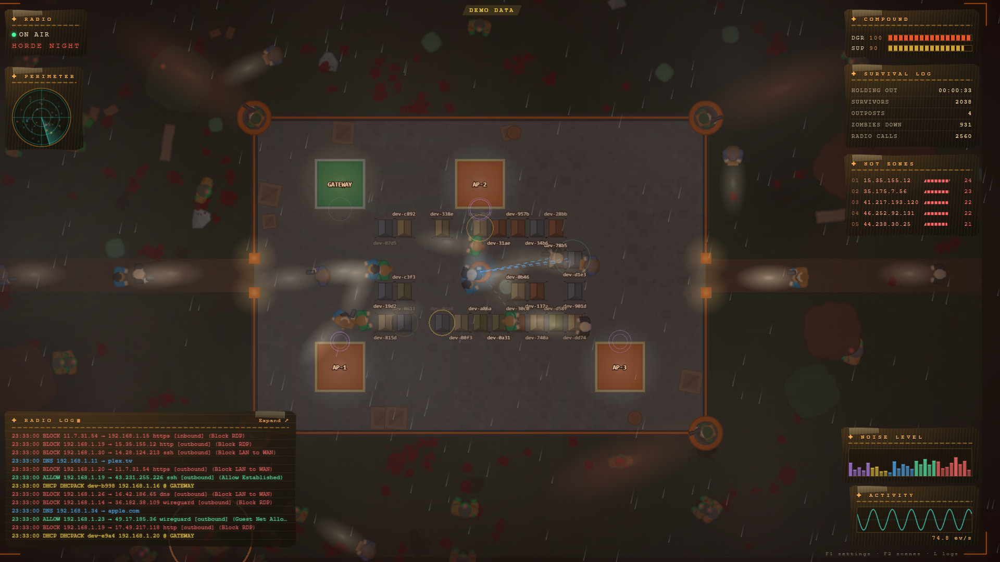
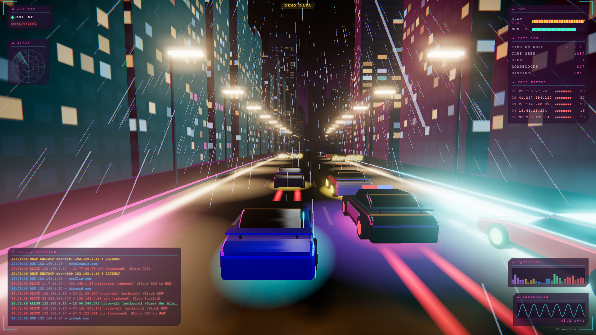
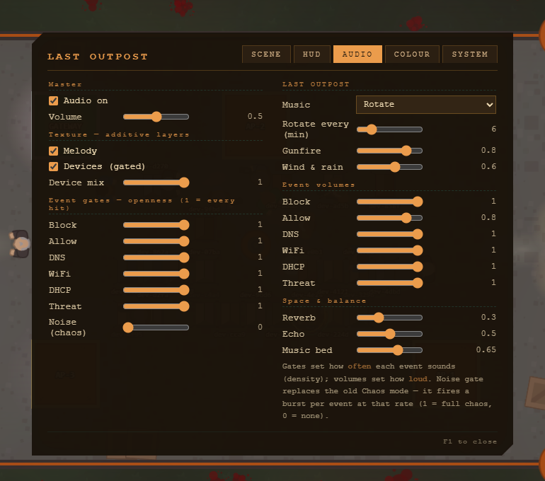
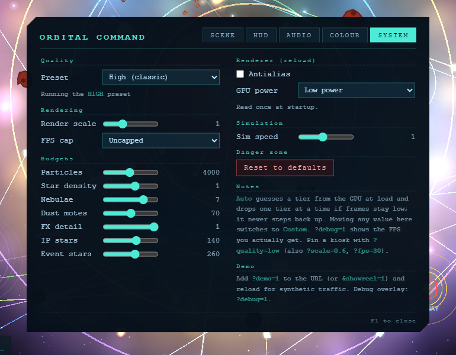

# pewpew

**Your UniFi network as a living scene, with a soundtrack it plays itself.**
pewpew turns UniFi gateway and AP syslog into a real-time visualizer in the
browser. Every firewall hit, DNS lookup, DHCP lease and Wi-Fi join becomes
something on screen, and everything you hear is synthesized live from your own
traffic. Pick a look per screen: **Orbital Command**, a space station
defending your network; **Last Outpost**, a walled compound holding out
against the internet's zombies; or **Midnight Run**, a 3D street race through a
neon city at night. No database, no cloud and no recordings. It only reads
syslog and never touches the network itself.

| Orbital Command (sci-fi, default) | Last Outpost (zombie) | Midnight Run (racing) |
|---|---|---|
|  |  |  |

| Midnight Run | Last Outpost |
|---|---|
|  |  |

**[Try the browser demo](https://scratchhax.github.io/pewpew/)** (synthetic
traffic, no hardware) ·
[Last Outpost demo](https://scratchhax.github.io/pewpew/?theme=zombie) ·
[Midnight Run demo](https://scratchhax.github.io/pewpew/?theme=racing) ·
sci-fi showreel: [gif](docs/demo.gif), [mp4 with sound](docs/demo.mp4)

## Contents

- [Highlights](#highlights)
- [Try it](#try-it)
- [Run it on your network](#run-it-on-your-network)
- [Themes](#themes): [Orbital Command](#orbital-command) · [Last Outpost](#last-outpost) · [Midnight Run](#midnight-run) · [Choosing a theme](#choosing-a-theme)
- [Sound](#sound)
- [Settings (F1)](#settings-f1)
- [Performance and quality](#performance-and-quality)
- [URL parameters](#url-parameters)
- [Deploying on a Raspberry Pi](#deploying-on-a-raspberry-pi)
- [How it works](#how-it-works)
- [Health, privacy, troubleshooting](#health-and-diagnostics)
- [Credits](#credits)

## Highlights

- **Three themes, one relay.** Orbital Command, Last Outpost and Midnight Run
  draw the same traffic. Every screen picks its own theme, so the kiosk in the
  hall and the laptop on your desk can show different worlds at the same time.
  Two are 2D (PixiJS), one is full 3D (three.js); a screen only downloads the
  renderer its theme uses.
- **A readable picture.** One fixed colour per event type (block is red,
  allow green, DNS blue, DHCP yellow, Wi-Fi purple, threats amber) in both
  themes and in the scrolling log, so you can tell what's happening at a glance.
- **Generative soundtracks.** Each theme has six styles in rotation (synthwave,
  a pipe organ and chiptune in space; horror synth and dead west in the
  compound; drum and bass, eurobeat and a nu-metal riff on the street), and the
  scene's own sounds play along on the beat and in key: lasers, gunfire, an
  engine that shifts gears in time. No audio files anywhere.
- **The scene moves with the music.** The station's core breathes on the beat;
  zombies shamble in time; the city's neon swells on every bar.
- **Runs on anything.** Quality presets with an Auto mode size the scene to
  the device looking at it, from a gaming PC down to a Raspberry Pi 5 kiosk.
- **Zero footprint.** Syslog is parsed in RAM and fanned out over WebSocket.
  Nothing is written to disk and there are no accounts or telemetry.

## Try it

**In the browser:** the [GitHub Pages demo](https://scratchhax.github.io/pewpew/)
runs on synthetic traffic. Click once to start the sound (browser autoplay
rules) and press **F1** for settings. Add `?theme=zombie` for Last Outpost,
`?showreel=1` for a looping calm → storm → cooldown story, or
`?rate=40&block=65` to turn up the traffic.

**Locally:**

```bash
cd web
npm install
npm run dev
```

Then open `http://localhost:5173/?demo=1` (or `/zombie/?demo=1`). `?demo=1`
generates fake IPs, MACs and hostnames, so it's safe to screenshot and share.

The Pages site is rebuilt by `.github/workflows/pages.yml` whenever `web/`
changes on `main`, or from **Actions → Deploy demo to GitHub Pages**. That
build (`npm run build:demo`) always uses synthetic traffic and needs no relay.
On a fork, set **Settings → Pages → Build and deployment** to **GitHub
Actions** first.

## Run it on your network

1. **Start the relay** (Python 3.10+):

   ```bash
   cd relay
   python3 -m venv .venv
   .venv/bin/pip install -r requirements.txt
   .venv/bin/python pewpew_relay.py
   ```

2. **Build the viewer** (Node 18+, on any machine): `cd web && npm ci && npm run build`.
   The relay serves `web/dist/` with no-cache headers, so a refresh always gets
   the current build.

3. **Point UniFi at it.** In your UniFi OS console, go to **Settings →
   Advanced → Remote Syslog** and set the host to the relay machine and the
   port to **5514**. Enable logging on the firewall rules and zones you want
   to see.

4. **Open** `http://<relay-host>:8080/`.

### `relay/relay.yaml`

| Key | Default | What it does |
|-----|---------|--------------|
| `syslog_bind`, `syslog_port` | `0.0.0.0`, `5514` | where syslog (UDP) is received |
| `http_host`, `http_port` | `0.0.0.0`, `8080` | the viewer, WebSocket and health endpoints |
| `default_theme` | `scifi` | theme served at `/` (every theme is also at `/<theme>/`) |
| `buffer_size` | `500` | recent events replayed to each newly opened browser |
| `wan_interfaces` | `[ppp0]` | which gateway interfaces count as WAN, for inbound/outbound. Look at the `IN=`/`OUT=` fields of your firewall log lines; `eth8`–`eth10` are common on UDM/UDR |
| `drop_log_types` | `[]` | log types to hide, e.g. `[system]` |
| `drop_patterns` | UDM/AP chatter | regexes matched against raw lines and dropped before parsing (see `/drops`) |
| `tracks_dir` | `tracks` | where uploaded background tracks are stored (relative to `relay/`, git-ignored) |
| `max_track_mb` | `60` | largest background track the relay accepts |

The relay understands both the classic iptables-style firewall logs and the
CEF security events from gateways on the CyberSecure/Enhanced tier (IDS/IPS
threats included). `python3 relay/test_cef.py` self-checks the CEF parser.
`pewpew_relay.py --demo` generates fake events on the server side too.

## Themes

### Orbital Command



Your network is an orbital station. Hosts drift in as stars and grow into
constellations, blocked traffic comes in as asteroids the station shoots down,
and the whole thing rides a parallax nebula.

| Event | Colour | On screen |
|-------|--------|-----------|
| allow | green | crystals between the core and a device, star-to-star links, the inner ring |
| block | red | an inbound asteroid intercepted by the station's laser, with a shake and flash |
| dns | blue | a blue laser from the client to the station, the second ring |
| dhcp | yellow | a planet labelled with the client's hostname drifts across; the logging AP core ripples |
| wifi | purple | joins send a crystal from the AP core to the station; leaves and failures fire a laser back |
| system | grey | a grey shockwave from the station |
| threat | amber | an IDS/IPS attack rocket weaves in on an evasive path, is shot down near the station, and turns the core red while any rocket is alive |

Traffic volume sets the weather: **STORM** at 300 events per 30 seconds and
**HURRICANE** at 1200. The readout turns amber or red, the station flares and
the field fills with debris and intercept fire. Busy IPs grow into
constellations, and blocked destinations rank on the **MOST WANTED** board.

### Last Outpost



The same traffic as a walled compound seen from above: your network is inside
the walls, the internet is everything outside. The HUD is relabelled to match
(RADIO, COMPOUND, SURVIVAL LOG, HOT ZONES, RADIO LOG…).

| Event | On screen |
|-------|-----------|
| block | a zombie shambles in from a bearing fixed by the remote IP. The nearest tower guard turns and fires; rounds fly to it and it topples when they land. The odd one reaches the fence (a breach nudges the camera) |
| threat | a horde: a brute leading a weaving pack. The nearest towers open fire with bursts, the scene takes on a steady red cast and the floodlights turn red while the brute lives |
| allow (border) | supply runs: outbound, a scavenger runs from the camp through a gate and off the map; inbound, a survivor carries a crate in. Survivors step around zombies, and the towers shoot any zombie that gets close to one |
| allow (LAN↔LAN) | a courier strolls between two tents |
| dns | a dashed radio call from the client's tent to the mast, whose blue light warms with traffic |
| dhcp | a new survivor walks in through a gate and pitches a tent labelled with the device's hostname. Renewals ring the tent; names fade when a device goes quiet |
| wifi | AP and gateway hosts are buildings: joins walk in the door, leaves and failures hurry out, and the building's lamp warms toward its recent activity |
| system | the generator browns out: every light dims smoothly and recovers |

**Dead country.** The ground and trees are drained to grey-brown, with old
bloodstains outside the walls. That happens once when the scene is built, so
it costs nothing per frame. Traffic weather is the time of day: CALM is an
overcast day, STORM is dusk with rain, HURRICANE is horde night with heavy
rain and thick fog. A cold gloom always deepens toward the screen edges.

**No flashing.** Every light and colour change in this theme eases over about
a second. Nothing strobes or blinks, and routine kills don't shake the screen.

**Move with the music** (on by default). Zombies shamble and bob in time with
the soundtrack, guards sweep their watch once every eight bars, the
floodlights breathe slowly with the music's loudness, the mast light swells on
each bar, and during a horde the red wash follows the heartbeat. The scene
keeps its own clock and eases toward the music's beat (never more than ±50%
speed), so a new song never makes anything jump. With the sound off it keeps a
steady walking tempo.

Sprites are from Kenney's CC0 [Top-down Shooter](https://kenney.nl/assets/top-down-shooter) pack.

### Midnight Run



The network as a street race through a neon city at night, in real 3D
(three.js) with a chase camera. The road is straight; a curved-world shader
bends everything ahead of the car into sweeping corners and hills. Wet asphalt
reflects the street lights and taillights, and bloom makes the neon glow.
Everything is built in code: the car, the city, the signs and textures.

| Event | On screen |
|-------|-----------|
| allow | cars on the road: outbound traffic ahead that you pass, inbound traffic coming up from behind to overtake |
| block | a striped barricade across one or two lanes. Drivers swerve into a clear lane; anything that hits it smashes it (pieces fly), loses speed and gets knocked sideways |
| threat | a police chase: a black-and-white with a flashing red-and-blue light bar closes in and runs alongside until the heat dies down. Every IDS/IPS event gets its cop: if there is no room behind you right away it keeps trying (other lanes, further back, or pulling out ahead) for several seconds, and a cop held up in traffic rides bumpers instead of giving up |
| dhcp | a rival appears up ahead with the device's hostname on a plate. You reel it in, race side by side, then it boosts away |
| dns | the next neon billboard over the horizon shows the domain, in DNS blue |
| wifi | a neon gate over the road labelled with the AP: a full arch for a join, a broken dim one for a failure |
| system | the street lights brown out in a wave rolling away down the road |

Traffic sets the cruising pace (about 100 km/h on a quiet network, over 200 when
it's busy). When your driver sees several seconds of empty road on its line it
sprints like a racer, up to about 85 km/h over cruise: a hard pull through the low gears that
tapers near the top, with a beat of lost drive at every shift (watch the tach).
When traffic closes in it lifts off and coasts back down; it never brakes. Motion
blur streaks the edges of the screen out from the vanishing point as the speed
climbs (your car and the road ahead stay sharp). **Motion blur** is a quality
slider: off on Low, stronger on Ultra. A sudden burst lights the nitro: the camera pulls back, the field of
view widens, and blue flames and speed lines kick in. Traffic weather is the
rain: a dry (but always damp) night, then a wet storm, then a monsoon. Like
Last Outpost, nothing else flashes: neon and brownouts ease; only the police light bars flash.

**Every event is a window.** Each live event lights one real window on a building coming up ahead, in its event colour (the same colour law as the log: green allow, red block, blue DNS, yellow DHCP, purple Wi-Fi, amber threat, grey system). The window eases on over about a second, then fades over about fifteen, so a busy network paints the city in its traffic while the ordinary warm and cool office lights stay underneath.

**The dash.** The HUD is the car's instrument cluster, and every needle swings
on a spring. Nothing blinks.

| Instrument | What it shows |
|------------|---------------|
| Sat nav | a heading-up moving map: the winding road with its neon curbs, city blocks, cross streets named after recent DNS lookups, every car (rivals yellow, police swaying red and blue, wrecks grey), roadblocks and gates, the route your driver is taking, the next gate or roadblock with its distance, the weather and the miles covered |
| Radar detector | an LED detector. Traffic lights up bands: X for DNS, DHCP and Wi-Fi, K for allowed flows, Ka for blocks, and laser for threats, locked on while the police are on you. It also has signal-strength LEDs and front, side and rear arrows (outbound, internal and inbound traffic) |
| Heat | an analog coolant gauge from C to H with a red zone (threat level) |
| NOS | an analog bottle-pressure gauge in PSI with a cyan sweet spot (network energy); it glows while the nitro fires |
| Tach | an analog tachometer on the car's real gear and revs with a redline, a digital MPH readout, the gear, and the event rate |
| Equalizer, race log, most wanted, police scanner | as in the other themes, restyled |

**Physics.** Nothing drives through anything. Every car has a footprint,
momentum, sideways velocity, a heading and spin. Drivers follow the car
ahead, brake when a gap closes and only change lanes when the next lane is
clear. When cars do touch (checked as oriented rectangles, sub-stepped so
fast cars can't pass through each other) they push apart and trade momentum,
and an off-centre hit spins them. A hard hit makes a car lose control: it
spins out, slides to the shoulder, scrubs to a stop and becomes an obstacle
for everyone behind it. Your car is never taken out; it gets knocked about,
loses speed and fishtails, then recovers. Sparks fly where metal meets metal,
and every crash is heard in place.

**There's always a path, and no brakes.** Your car has no brake lights, and it
never slows down for traffic. It holds its cruising speed or puts its foot down,
and a busy network makes it faster. Your driver plans in space and time. About
twelve times a second it tries around a hundred moves: any point across the road
(between lanes and along the curb included), up the curb onto the sidewalk
(dodging the street-light poles), each at cruising speed or with a boost. It
plays each one forward for two seconds against where every car will be, using
your car's real sideways grip and acceleration. Wrecks count as wide,
fast-slowing obstacles sliding for the shoulder. The best clean move wins. Lane
centres, the middle of the road and short moves are preferred (home is the two inner lanes, where the action is), the curb is only an escape, and the sidewalk is the last resort
when the road is shut. The car hops the curb with a thump and sparks, and gets
back on the road when there's room. Hits barely cost it any speed: the other
car takes the shove.

When nothing is clean, your driver gets wild. It accepts tighter gaps (paint
gets traded), flicks across harder with the tail hanging out, gets heavier to
shove with, and leans on the horn. The cars in the way are
asked to clear it: an outside-lane car squeezes onto the curb so you can go by
on the inside, others change lanes, and if they can't they floor it. Rivals
and police pace themselves off your cruising speed, not your current speed, so
if you're held up they pull away instead of slowing into a moving wall. New
traffic never fills every lane at the same distance, and traffic keeps its own
pace. How wild your driver starts rises with the event rate: polite on a quiet
network, a battering ram on a busy one.

Measured headless over two minutes of demo traffic at 12, 20 and 30 events a
second, your car averages 99 to 104% of its cruising speed, never drops below
85% of it (only briefly, after a hard knock), and takes about 13 to 18 knocks a
minute.

### Choosing a theme

One relay serves every theme, so different screens can show different themes
at once:

| URL | Theme |
|-----|-------|
| `http://<relay-host>:8080/` | the relay's `default_theme` |
| `http://<relay-host>:8080/scifi/`, `/zombie/`, `/racing/` | that theme (unknown names are a 404) |
| any URL + `?theme=racing` | that theme (handy on the Pages demo) |

The viewer checks the URL path, then `?theme=`, then the relay's
`/config.json`, and falls back to `scifi`. Each theme is its own bundle, so a
screen only downloads the theme it shows.

## Sound

All sound is synthesized in the browser with the WebAudio API. Browsers only
allow audio after a click or keypress, so click once to start it.

### Orbital Command's soundtrack

Six styles take turns, every 6 minutes by default:

| Style | Sound |
|-------|-------|
| Neon cruise | synthwave: four-on-the-floor, octave bass (Am–F–C–G), gated snare, a saw hook, arps when it's busy |
| Blade cosmos | slow brassy swells over a sub (Dm–B♭–C–Am, dorian), cold bell arpeggios with long echoes, taiko at night |
| Stellar organ | a pipe-organ ostinato climbing through the chord (Am–F–C–Em) over a ticking clock, a choir when it's busy |
| Arcade | a chiptune shooter at 138 bpm: square bass, noise drums, arpeggios and a pentatonic riff |
| Deep drift | a drone gliding between chords in E lydian, slow swells, pulsar pings in three-over-four |
| Fleet battle | a string ostinato, brass stabs and taiko drums (Dm–B♭–C–A) |

**Classic band** in the Music menu brings back the original generative band:
a set list of four melodies with song form (intro, verse, chorus, bridge,
outro), per-device voices, and a low drone while a threat rocket is alive.

The station's sounds play along, on the beat and in key:

| Event | Sound |
|-------|-------|
| asteroid intercepted | a defense laser diving onto a chord tone, then an explosion with a ring in key |
| threat | a rocket launch; its interception is a bigger blast. While rockets are alive, a shield thump every two beats and a red-alert tone every four bars |
| impact on the core | a big blast and a boom |
| block | a low sonar ping as the asteroid appears |
| allow | traffic plays the melody on the style's lead (saw, bell, organ, chip or glass) |
| dns | a soft high ping |
| dhcp | a warp-in whoosh onto a note as the planet arrives |
| wifi | rising pings for a join, a falling zap for a leave or failure |
| system | a shockwave: a low tone sweeping a filter open and shut |

The station hums and space hisses underneath, with radio crackle in storms.
**Move with the music** (Scene tab) makes the core breathe on the beat and the
stars and dust drift faster when the music is loud.

### Last Outpost's soundtrack

Six styles take turns, every 6 minutes by default, crossfading between them:

| Style | Sound |
|-------|-------|
| Horror synth | a pulsing minor ostinato (Am–F–Dm–E) over a saw drone, cold bells, a choir at night |
| Lonely survivor | fingerpicked guitar and a slightly detuned piano (Dm–B♭–F–C) over the wind, a cello at night |
| 80s slasher | driving octave bass (Em–C–Am–B), drum machine with a big gated snare, a brassy saw hook |
| Dark ambient | a breathing drone gliding between chords, distant swells, scraping metal |
| Dead west | banjo rolls, a bowed fiddle drone, boot stomps and a slide guitar (E dorian) |
| Broken lullaby | a music box on warped tape in 3/4 (Cm–A♭–Fm–G), glass harmonics, whispers at night |

The compound's sounds are part of the band. Each is snapped to the beat and
pitched to the chord that's playing:

| Event | Sound |
|-------|-------|
| guards fire | a punchy rifle shot with a ring in key; a brute's burst lands as a roll |
| block | a zombie groan on the chord root |
| threat | a horde roar and a boom; during the attack, a heartbeat and swells into every fourth bar |
| allow | traffic plays the melody on the style's lead instrument |
| dns | a radio chirp |
| wifi | a door creaking open (join) or shut |
| dhcp | a strummed music-box chord |
| system | the generator sputtering |
| breach | a boom and a metal clang |

Night thickens the arrangement (sixteenths instead of eighths, drums, choir
or cello). Wind is always there and rain comes in with the weather. Effects go
through their own limiter, so a busy night stays punchy without clipping.

### Midnight Run's soundtrack

Seven styles take turns, every 6 minutes by default:

| Style | Sound |
|-------|-------|
| Tokyo drift | a written song, not a generator: Tokyo street-racing hip-hop at 130 bpm in B♭ minor. Every hit is a one-16th staccato wall of stacked brass and saws across three octaves on a syncopated 3-3-2 grid, and the arrangement stacks layers as it builds (drums at bar 8, the full stack at bar 16). Claps and 808s, a whistle topline, crowd "hey!" shouts, koto, taiko, scratches and a gong fill it out, in a 32-bar loop. Chords, topline and every part are original |
| Street breaks | big-beat breakbeats at 132 bpm, a squelchy acid bass line, supersaw stabs when it's busy |
| Night drive | slow synthwave (Em–C–A–D): octave bass, arpeggios, a saw lead melody |
| Liquid DnB | 172 bpm rollers, a reese bass and airy seventh-chord pads |
| Chrome riff | drop-D palm-muted power chords through a distortion curve, a heavy backbeat |
| Trap lights | half-time 808s that slide between notes, hi-hat rolls, a bell line |
| Eurobeat rush | four-on-the-floor, offbeat octave bass, supersaw riffs (for the Initial D fans) |

The car is part of the band:

| Event | Sound |
|-------|-------|
| driving | an engine note pitched to the chord that climbs through each gear with speed; shifts wait for the beat and land with a turbo blow-off |
| nitro | a whoosh and a roar as it lights |
| collisions | a metal crash ringing in key for hard hits, a panel knock for light bumps, heard where they happen |
| boxed in | a long lean on the horn |
| block | a horn honking a fifth |
| threat | a soft siren wail across two chord tones while the police are on you |
| dhcp | a rival's engine revving past |
| allow | traffic plays the melody on the style's lead |
| dns / wifi / system | a radio chirp / rising pings / a power-grid shockwave |

Road roar rises with speed and rain comes in with the weather. **Move with the
music** (Scene tab) makes the curb neon and your underglow swell on every bar.

### Background tracks

Play your own music in any theme. In F1 → Audio → **Background track**, upload
an MP3, OGG, M4A, WAV or FLAC file. It's stored on the relay, so every screen
can use it: pick a track per theme, and every screen showing that theme plays
it within about 20 seconds, the kiosk included.

- When a track loads, the viewer works out its **tempo, beat position and key**
  (in a background worker, once per track) and saves the result on the relay.
  The panel shows what it found; type a tempo to correct it, or **Re-detect**.
- While a track plays, the track is the only music. The theme's generated
  soundtrack steps aside, and so does every event sound that's really a note:
  pings, chirps, arpeggios, music-box strums and drum pulses. Real sound effects
  stay, locked to the track's beat: gunshots, groans, lasers, blasts, crashes,
  horns and the engine, which stops following the chords and sits lower in the
  mix. Music-driven visuals follow the track's beat and loudness.
- **Track volume** sits under Space & balance. Choose **None** to go back to the
  theme's own soundtrack, or delete the track from the relay.

The relay API behind it, handy for scripting:

```bash
curl -F file=@mytrack.mp3 http://<relay-host>:8080/api/tracks          # upload
curl http://<relay-host>:8080/api/tracks                               # list + assignments
curl -X PUT -H 'Content-Type: application/json' \
  -d '{"theme":"racing","name":"mytrack.mp3"}' http://<relay-host>:8080/api/tracks-assign
curl -X DELETE http://<relay-host>:8080/api/tracks/mytrack.mp3         # delete
```

A track assigned without analysis (for example, uploaded with curl) is analysed
by the first screen that plays it. Background tracks need a relay, so they
aren't available on the GitHub Pages demo.

### Mixing

The **Audio** tab is shared by every theme:

- **Melody** and **Devices** are layers that add together: the music, and the
  sounds triggered by events.
- Every event type has a **volume** (how loud) and a **gate** (how often it
  sounds, from 0 = never to 1 = every time). Gates thin a busy stream without
  changing its level.
- **Noise (chaos)** fires a short sound on a fraction of *raw* events, straight
  from the feed. 0 is off, 1 is every event.
- **Reverb**, **echo** and **Music bed** (music against event sounds).

Each theme adds **Music** (Rotate, or pin one style; sci-fi also has Classic
band), **Rotate every (min)**, and two volumes of its own: **Lasers &
blasts** and **Station hum** for Orbital Command, **Gunfire** and **Wind &
rain** for Last Outpost, **Engine & nitro** and **Road & rain** for Midnight
Run. Each theme keeps its own choices.



## Settings (F1)

Press **F1** for the settings panel. Changes apply live and are saved in the
browser. The two renderer options, antialias and GPU power, apply after the
panel's *Apply & reload*.

| Tab | What's in it |
|-----|--------------|
| **Scene** | the theme's toggles. Sci-fi: starfield, nebula, dust, ambient ships, DHCP planets, event stars, asteroids, attack rockets, crystals, IP constellations, ring objects, AP cores, screen shake, move with the music. Last Outpost: zombies, hordes, supply runs, couriers, DNS radio, DHCP arrivals, AP buildings, day/night, rain, blood, screen shake, move with the music. Midnight Run: traffic, roadblocks, police chase, rivals, DNS billboards, Wi-Fi gates, rain, camera nudge, move with the music |
| **HUD** | each HUD panel on or off (names follow the theme), plus scanlines |
| **Audio** | see [Mixing](#mixing) |
| **Colour** | global hue shift and intensity for the HUD accent; sci-fi also recolours its host mesh (spectrum, event law, mono, warm, cool). Event colours never change |
| **System** | quality preset, render scale, FPS cap, the theme's scene budgets, antialias and GPU power, simulation speed, reset to defaults |


## Performance and quality

The relay never renders anything: each browser draws the scene on its own GPU.
How smooth it runs depends on the device *viewing* it, and a quality tier
bundles every setting that trades looks for frame time.



| Renderer | Low | Medium | **High** | Ultra |
|----------|-----|--------|----------|-------|
| Render scale | 0.6 | 0.8 | 1.0 | device pixel ratio (≤2) |
| FPS cap | 30 | 60 | none | none |
| Antialias | off | off | off | on |
| GPU power | low-power | browser default | low-power | high-performance |

| Orbital Command budgets | Low | Medium | **High** | Ultra |
|-------------------------|-----|--------|----------|-------|
| Particles | 800 | 2000 | 4000 | 8000 |
| Star density | 0.4 | 0.7 | 1.0 | 1.5 |
| Nebula clouds | 3 | 5 | 7 | 9 |
| Dust motes | 20 | 45 | 70 | 140 |
| Effect detail | 0.5 | 0.75 | 1.0 | 1.0 |
| IP stars / event stars | 60 / 100 | 100 / 180 | 140 / 260 | 200 / 400 |

| Last Outpost budgets | Low | Medium | **High** | Ultra |
|----------------------|-----|--------|----------|-------|
| Particles | 600 | 1500 | 3000 | 6000 |
| Zombies at once | 8 | 10 | 12 | 18 |
| Blood decals | 30 | 70 | 140 | 260 |
| Rain density | 0.3 | 0.6 | 1.0 | 1.5 |
| Tents | 16 | 22 | 28 | 36 |
| Fog + survivor flashlights | off | on | on | on |

| Midnight Run budgets | Low | Medium | **High** | Ultra |
|----------------------|-----|--------|----------|-------|
| Cars on the road | 8 | 14 | 20 | 32 |
| Draw distance (m) | 380 | 520 | 700 | 900 |
| Rain | 0.35 | 0.6 | 1.0 | 1.5 |
| Bloom | off | on | on | on |
| Lens (vignette, colour fringe) | off | off | on | on |
| Motion blur | 0 | 0.45 | 0.6 | 0.8 |

Midnight Run is a full 3D scene built to look good first; it's meant for a
desktop or laptop GPU. Its Low tier is a starting point for smaller devices,
not yet tuned for a Pi.

- **Auto** (the default) guesses a tier at load, then watches the real frame
  rate. Software renderers, Pi and phone GPUs, and browsers without WebGL
  start at Low. Touch devices, machines with ≤4 cores or ≤4 GB of memory, and
  Intel HD/UHD graphics start at Medium. Everything else starts at High. If
  frames stay under 75% of the target for 5 seconds, Auto drops one tier. It
  never steps back up, so it can't flap, and the System tab says which tier
  it's running and why.
- Moving any single value switches the preset to **Custom** and keeps your
  numbers.
- **Render scale** trades sharpness for GPU work: 0.6 draws about a third of
  the pixels of 1.0. The HTML HUD isn't scaled, so on a small board driving a
  big display the browser's own compositing is often the limit.
- On a kiosk without a keyboard, pin values in the URL: `?quality=low`,
  `?scale=0.6`, `?fps=30`. These apply to that load only and aren't saved.

**Measured on a Raspberry Pi Compute Module 5** (Chromium kiosk at
2560×1440, Auto → Low, demo traffic):

| Scene | FPS |
|-------|-----|
| Orbital Command, normal traffic | about 24–26 |
| Orbital Command, heavy traffic (`rate=40&block=65`) | 23.6 |
| Last Outpost, calm day | 25.5 |
| Last Outpost, heavy traffic at night | 20.3 |

With the soundtrack playing, expect 2–3 fps less (sci-fi's band cost 2.0,
Last Outpost's 2.9 in the same test). Chromium painting a 1440p page is the
real ceiling on that board: running the display at 1080p helps more than any
setting.

## URL parameters

| Parameter | Effect |
|-----------|--------|
| `/<theme>/` (path) or `?theme=` | pick the theme: `scifi`, `zombie` or `racing` |
| `?demo=1` | synthetic traffic, no relay needed |
| `?showreel=1` | with the demo: a looping 60-second calm → build → hurricane → cooldown arc |
| `?rate=40` | with the demo: about 40 events per second |
| `?block=65` | with the demo: 65% of firewall hits blocked |
| `?hosts=Router,Kitchen-AP` | with the demo: hostnames to use |
| `?quality=low` | pin the quality tier (`auto`, `low`, `medium`, `high`, `ultra`) |
| `?scale=0.6` | pin the render scale (0.25–2) |
| `?fps=30` | pin the FPS cap (`0` = uncapped) |
| `?debug=1` | overlay with FPS, worst frame, quality tier, render scale, scene nodes, events per second and audio stats |
| `?diag=1` | developer hook: exposes the scene objects on `window.__diag` |


## Deploying on a Raspberry Pi

```bash
sudo cp deploy/pewpew-relay.service /etc/systemd/system/   # adjust paths and user
sudo systemctl enable --now pewpew-relay
cp deploy/pewpew-kiosk.desktop ~/.config/autostart/        # fullscreen Chromium
```

A Pi doesn't need Node. Build the viewer on another machine and copy it into
the relay's checkout:

```bash
cd web && npm ci && npm run build
rsync -a --delete dist/ pi@<relay-host>:pewpew-ui/web/dist/
```

Static files update without a restart. Restart `pewpew-relay` only when
`relay/` changes; UniFi devices then take 1–3 minutes to resume logging.

The kiosk entry opens `http://localhost:8080/?quality=low`, a good start for a
Pi 5. Edit the URL to point at a relay on another host
(`http://192.168.1.5:8080/?quality=low`) or to pin a theme
(`http://192.168.1.5:8080/zombie/?quality=low`). The kiosk's browser still
needs one tap or keypress before it can play sound.

## How it works

```
UDM / UDR / APs ──syslog UDP :5514──► relay (Python) ──JSON over WebSocket──► browsers
                                        │                                       :8080
                                        └── also serves the built viewer:
                                            the default theme at /, every theme at /<theme>/
```

- **`relay/`**: an aiohttp server. It parses syslog with parsers vendored from
  [UniFi-Insights-Plus](https://github.com/jmasarweh/UniFi-Insights-Plus)
  (database and policy dependencies removed), drops known log spam, keeps a
  ring buffer of recent events, and broadcasts every event to every browser.
- **`web/`**: Vite and TypeScript. Orbital Command and Last Outpost render
  with [PixiJS v8](https://pixijs.com/), Midnight Run with
  [three.js](https://threejs.org/). The audio and nearly all graphics are
  generated in code; Last Outpost adds one small sprite atlas.
- **`deploy/`**: the systemd unit and the kiosk autostart entry.

### Viewer: core and themes

| Core (`web/src/`) | Theme (`web/src/themes/<id>/`) |
|-------------------|--------------------------------|
| relay feed and demo generator (`ws.ts`) | its renderer (any: PixiJS, three.js, …) and scene |
| event classification (`events.ts`): allow, block, threat, dns, dhcp, wifi, system, plus direction and Wi-Fi outcome | what each event becomes on screen, and which repeats are worth drawing |
| sim state and weather (`state.ts`), per-flow throttle (`throttle.ts`) | Scene tab toggles, colour options, HUD names and accent colour |
| HUD, log, F1 panel, audio engine and the classic band (`audio.ts`), shared score machinery (`sound/`: synth, conductor, groove) | optionally its own `score`: music and sound design, with Audio tab controls |
| quality presets, auto tuner, frame loop (`perf.ts`, `loop.ts`) | scene budgets per quality tier |
| boot and event pipeline (`app.ts`), theme registry | a `Theme` object as the default export (`theme.ts` is the contract) |

For each event the core logs it to the HUD, feeds the noise gate and the sim
state, then hands the theme a classified event. Each frame the core advances
time (sim speed, slow motion, FPS cap), computes a slow anti-burn-in drift, and
calls the theme's `frame()`. All settings live in one saved object, so HUD and
audio preferences carry across themes.

**Adding a theme:** create `web/src/themes/<id>/index.ts` with a default
export of a `Theme` (defaults, per-tier budgets, panel controls, `create()`).
The registry finds it, the build writes `dist/<id>/index.html` and the relay
serves it at `/<id>/`. To give it its own music, set `score` to a function
that receives the shared `AudioEngine` (context, output, reverb and echo sends,
settings) and returns a `Score`. The easy way is to extend `Conductor` from
`sound/conductor.ts`: it handles the clock, style rotation, snapping sounds to
the beat, chord lookup and the pulse, so a theme only writes its styles and
what each event sounds like. Every theme's `score.ts` is a worked example, and
`sound/groove.ts` shows how visuals can follow `audio.pulse()`. Nothing in the
core imports a renderer, so a theme can use whatever it likes: Midnight Run
brings three.js, and only screens showing it download it.

## Health and diagnostics

- `GET /healthz`: syslog lines per host, WebSocket clients, event counters
- `GET /drops`: which drop patterns are catching what
- `GET /config.json`: the default theme and the themes in the build
- `GET /api/tracks`: uploaded background tracks, their tempo/key and which theme plays which
- After a relay restart, APs and gateways stop logging for 1–3 minutes. That's
  UniFi's log forwarder backing off; it reconnects on its own.

## Privacy

- Everything runs on your LAN: no outbound connections, telemetry, analytics
  or accounts.
- Syslog is parsed in memory and sent over WebSocket; nothing is written to
  disk. Settings live in your browser's local storage.
- Demo mode uses fake IPs, MACs and hostnames.

## Troubleshooting

- **No sound:** click or press a key once; browsers block audio until you do.
- **Blank or stale after an update:** hard refresh (Ctrl+Shift+R).
- **Inbound and outbound look swapped:** set `wan_interfaces` in `relay.yaml`.
- **Choppy:** Auto should settle within about 30 seconds. If not, choose
  **Low** in F1 → System or add `?quality=low`, then lower **Render scale**.
  `?debug=1` shows the FPS you're getting. On a Pi driving a 1440p or 4K
  screen, a 1080p display mode helps most.
- **Soft or blurry:** you're on a lower tier or render scale; F1 → System
  shows which. Choose **High** (or **Ultra** on a high-DPI screen).

## Credits

- Syslog parsing vendored from
  [UniFi-Insights-Plus](https://github.com/jmasarweh/UniFi-Insights-Plus) (MIT).
- [PixiJS v8](https://pixijs.com/) renders Orbital Command and Last Outpost;
  [three.js](https://threejs.org/) renders Midnight Run.
- Every sound and melody, every sci-fi texture, and Midnight Run's car, city
  and signs are generated in code.
- Last Outpost sprites: [Top-down Shooter](https://kenney.nl/assets/top-down-shooter)
  by [Kenney](https://kenney.nl) (CC0), packed into
  `web/src/themes/zombie/assets/atlas.png` with its license beside it.
- IDS/IPS threat support (the attack rockets, the red core and the threat
  audio) grew out of the CEF security-event parser idea and first
  implementation by [natechit](https://github.com/natechit).

## License

[MIT](LICENSE)
