# pewpew

**Your UniFi network as a living scene, with a soundtrack it plays itself.**
pewpew turns UniFi gateway and access point syslog into a real-time visualizer
in the browser. Every firewall hit, DHCP lease, Wi-Fi join and IDS/IPS threat
becomes something on screen, and everything you hear is synthesized live from
your own traffic. Pick a scene per screen:

- **Orbital Command**: a space station defending your network
- **Last Outpost**: a walled compound holding out against the internet's zombies
- **Midnight Run**: a 3D street race through a neon city at night
- **Packet Rush**: a 16-bit side-scrolling runner, with boss fights
- **Panopticon**: a made-up planet under surveillance, where the eye of god
  zooms in on the people behind the traffic
- **Mainframe**: a god's-eye flight over a glowing circuit board at night, in
  the spirit of *Hackers*, where your traffic races the traces and turns at the
  junctions, diving into chips to trace intruders
- **Aquarium**: a 3D reef tank in the spirit of the old marine aquarium
  screensavers, where your traffic swims past as fish
- **The Gibson**: the storage wall from *Hackers* — a computer city of
  translucent monolith blocks lined in glowing cyan, patrolled at street
  level with sweeping ninety-degree corners, until the camera swings around
  to lock onto a red file and trace the intruder
- **Mycelium**: a bioluminescent forest floor from above, where hosts put out
  growing filaments that weave a mat across the loam — permitted traffic runs
  through it as travelling light, habit decides the roads, mushrooms fruit at
  busy junctions, and it's all still there when you reload

There's no database, no cloud and nothing is recorded. pewpew only reads syslog
and never touches the network itself.

| Orbital Command (default) | Last Outpost |
|---|---|
|  |  |
| **Midnight Run** | **Packet Rush** |
|  | 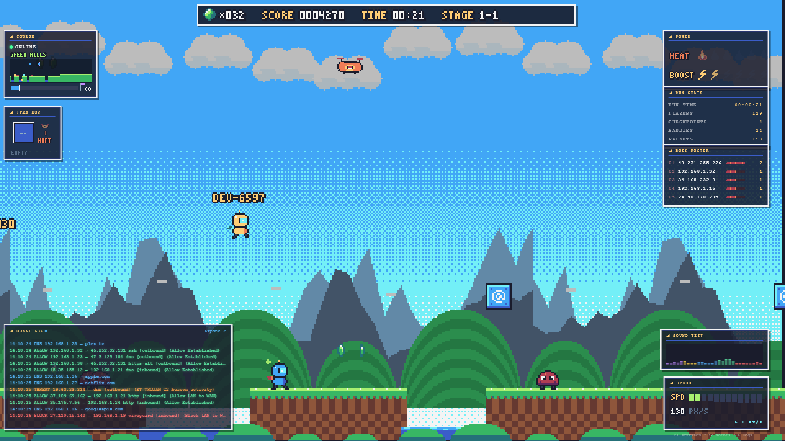 |
| **Panopticon** | **Panopticon: the eye of god** |
| 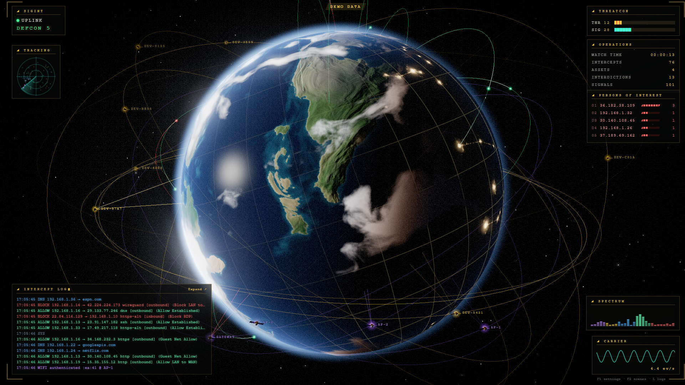 | 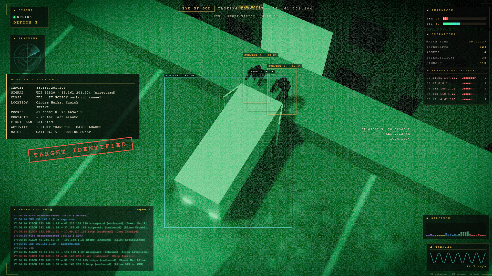 |
| **Mainframe** | **Mainframe: inside the chip** |
| 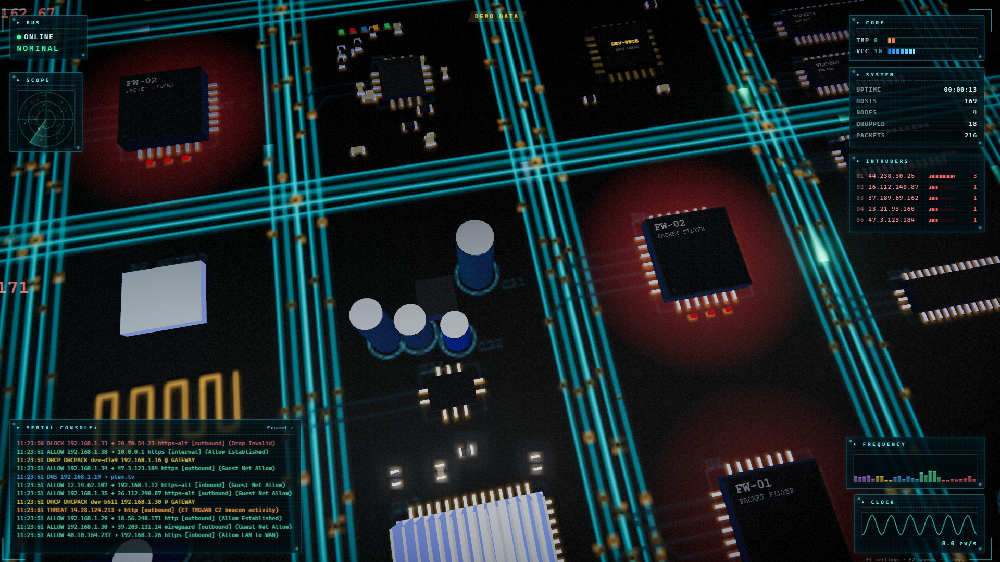 | 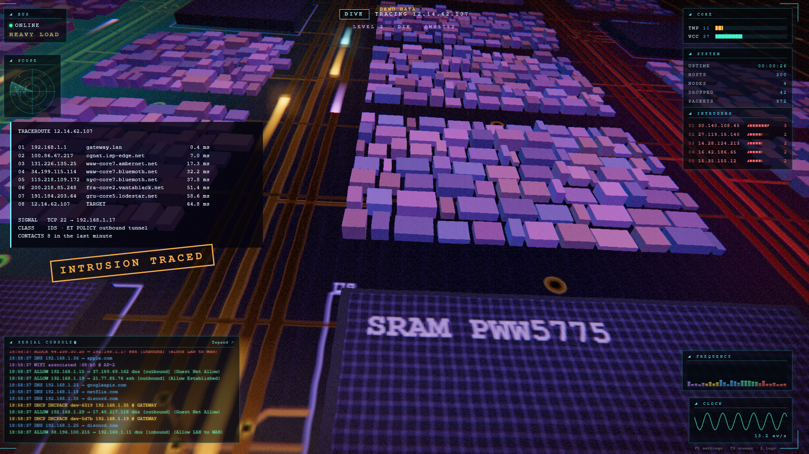 |
| **Aquarium** | **Aquarium: a shark comes through** |
| 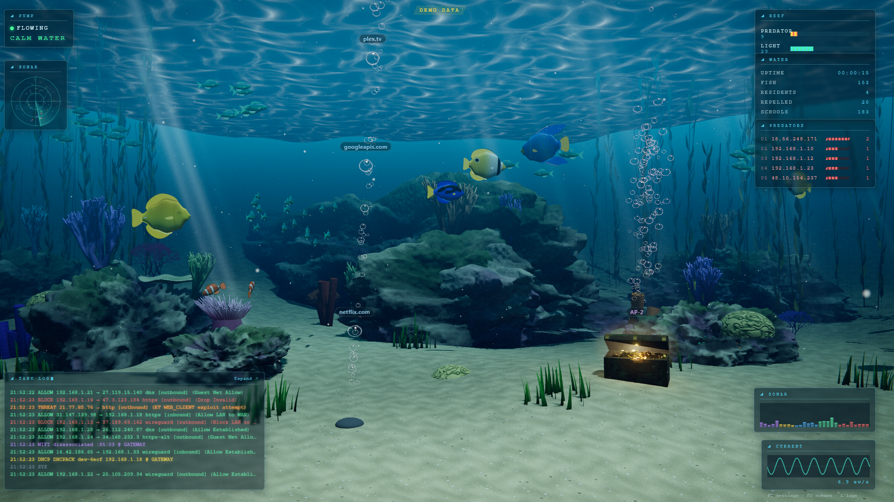 | 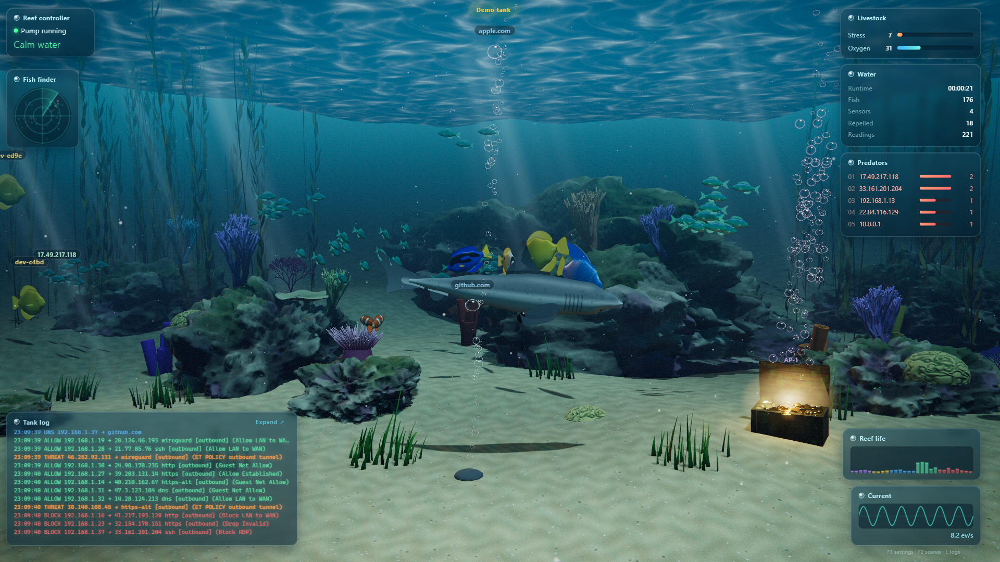 |
| **The Gibson** | **The Gibson: target lock** |
| 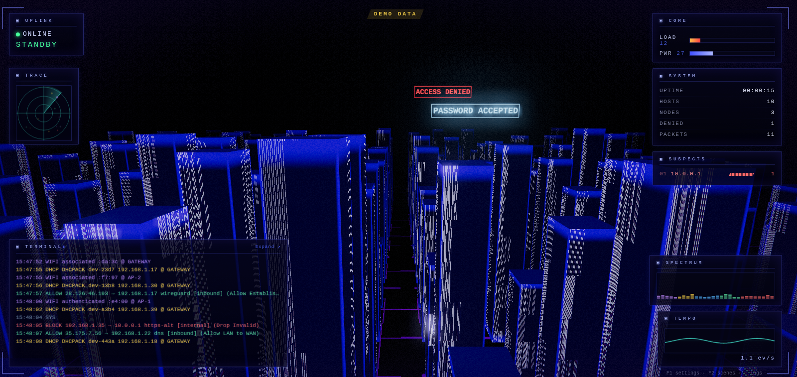 | 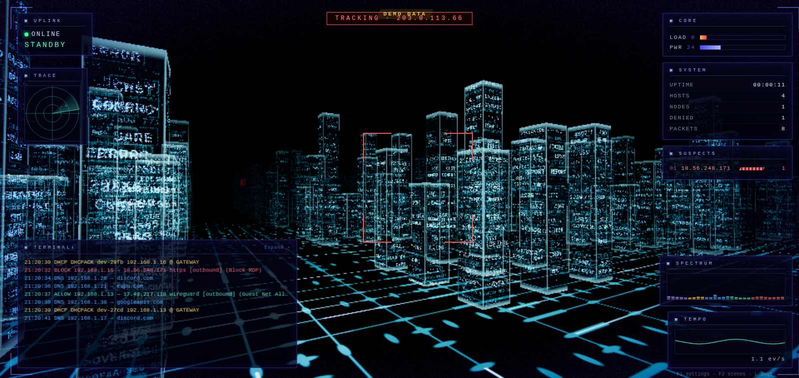 |
| **Mycelium** | **Mycelium: a blight swarm crawls in** |
| 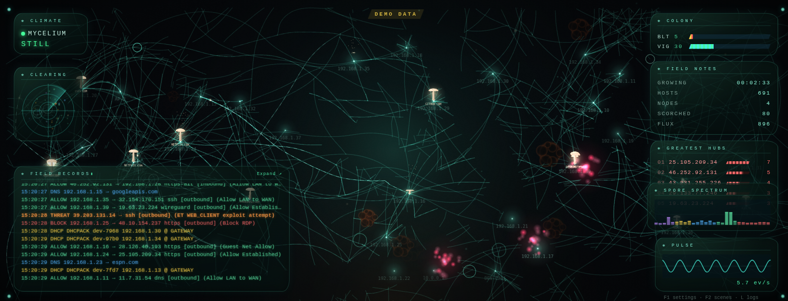 | 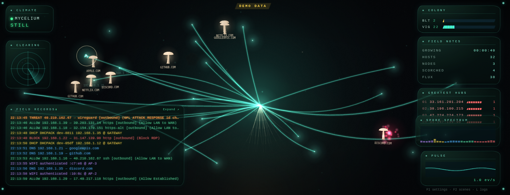 |

| Midnight Run | Packet Rush | Last Outpost |
|---|---|---|
|  | 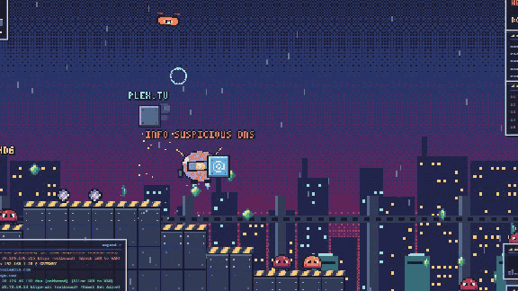 |  |

**[Try the browser demo](https://scratchhax.github.io/pewpew/)** (synthetic
traffic, no hardware needed): [Last Outpost](https://scratchhax.github.io/pewpew/?theme=zombie) ·
[Midnight Run](https://scratchhax.github.io/pewpew/?theme=racing) ·
[Packet Rush](https://scratchhax.github.io/pewpew/?theme=rush) ·
[Panopticon](https://scratchhax.github.io/pewpew/?theme=spy) ·
[Mainframe](https://scratchhax.github.io/pewpew/?theme=mainframe) ·
[Aquarium](https://scratchhax.github.io/pewpew/?theme=aquarium) ·
[The Gibson](https://scratchhax.github.io/pewpew/?theme=gibson) ·
[Mycelium](https://scratchhax.github.io/pewpew/?theme=mycelium) ·
Orbital Command showreel: [gif](docs/demo.gif), [mp4 with sound](docs/demo.mp4)

## Contents

- [Quick start](#quick-start)
- [Highlights](#highlights)
- [Setup](#setup): [Relay](#1-start-the-relay) · [Viewer](#2-build-the-viewer) · [UniFi logging](#3-send-unifi-logs-to-the-relay) · [Check it's working](#4-check-its-working) · [`relay.yaml`](#relayrelayyaml)
- [Using pewpew](#using-pewpew): [Keys](#keys) · [Switching scenes](#switching-scenes) · [Log inspector](#log-inspector) · [Settings](#settings-f1)
- [Scenes](#scenes): [Orbital Command](#orbital-command) · [Last Outpost](#last-outpost) · [Midnight Run](#midnight-run) · [Packet Rush](#packet-rush) · [Panopticon](#panopticon) · [Mainframe](#mainframe) · [Aquarium](#aquarium) · [The Gibson](#the-gibson) · [Mycelium](#mycelium)
- [Sound](#sound)
- [Performance and quality](#performance-and-quality)
- [URL parameters](#url-parameters)
- [Kiosk on a Raspberry Pi](#kiosk-on-a-raspberry-pi)
- [How it works](#how-it-works)
- [Health, privacy and troubleshooting](#health-and-diagnostics)
- [Credits](#credits)

## Quick start

**Just want to see it?** Open the [browser demo](https://scratchhax.github.io/pewpew/),
click once to start the sound and press **F2** to pick a scene.

**On your network** (Python 3.10+ and Node 18+):

```bash
git clone https://github.com/scratchhax/pewpew.git
cd pewpew/web && npm ci && npm run build
cd ../relay && python3 -m venv .venv && .venv/bin/pip install -r requirements.txt
.venv/bin/python pewpew_relay.py
```

Then, in the UniFi Network app:

1. **Settings → CyberSecure → Traffic Logging**. Under **Activity Logging
   (Syslog)** choose **SIEM Server**, enter the relay machine's IP and port
   **5514**, turn on **Debug Logs** and click **Apply Changes**.
2. **Settings → Policy Engine**: turn on **Syslog Logging** for the firewall
   policies you want to see.

Open `http://<relay-host>:8080/`, click once for sound, and press **F2** to pick
a scene. The details (and what to do if nothing shows up) are in [Setup](#setup).

## Highlights

- **Nine scenes, one relay.** Every screen picks its own scene, so the kiosk
  in the hall and the laptop on your desk can show different worlds at the same
  time. Three are 2D (PixiJS) and five are full 3D (three.js); a screen only
  downloads the renderer its scene uses.
- **A readable picture.** Each event type has one fixed colour in every scene
  and in the log: block is red, allow green, DNS blue, DHCP yellow, Wi-Fi
  purple, threats amber and system grey. You can tell what's happening at a glance.
- **Generative soundtracks.** Every scene has its own band: synthwave, a pipe
  organ and chiptune in space; horror synth and dead west in the compound; drum
  and bass, eurobeat and a nu-metal riff on the street; an original chip band in
  Packet Rush; cold-war synth and swung spy jazz in Panopticon; acid house,
  breakbeat and jungle in Mainframe; lounge, bossa and dub in the Aquarium;
  techno, EBM and cold dark-synth on the Gibson. The scene's sounds play along on the beat and in key: lasers,
  gunfire, an engine that shifts gears in time, gem chimes that climb the scale.
  There are no audio files anywhere, though you can upload your own
  [background track](#background-tracks).
- **The scene moves with the music.** The station's core breathes on the beat,
  zombies shamble in time and the city's neon swells on every bar.
- **Made for kiosks.** Press F2 to switch scenes from the screen itself, and
  the screen remembers the pick. Press L to dig through recent events.
- **Runs on anything.** Quality presets with an Auto mode size the scene to the
  device looking at it, from a gaming PC down to a Raspberry Pi 5.
- **Zero footprint.** Syslog is parsed in RAM and fanned out over WebSocket.
  Nothing is written to disk and there are no accounts or telemetry.

## Setup

pewpew has two parts. The **relay** is a small Python service that receives
syslog and forwards events to browsers. The **viewer** is a static web app the
relay serves. Run the relay on any always-on machine on your LAN (a Raspberry
Pi is plenty), then open the viewer from any browser.

```
UniFi gateway + APs ──syslog UDP :5514──► relay ──WebSocket──► browsers on :8080
```

### 1. Start the relay

Python 3.10 or newer:

```bash
cd relay
python3 -m venv .venv
.venv/bin/pip install -r requirements.txt
.venv/bin/python pewpew_relay.py
```

It listens for syslog on UDP **5514** and serves the viewer on **8080**. If
the machine runs a firewall, allow UDP 5514 in from your UniFi devices (for
example `sudo ufw allow 5514/udp`). To run it as a service, see
[Kiosk on a Raspberry Pi](#kiosk-on-a-raspberry-pi).

### 2. Build the viewer

Node 18 or newer, on any machine:

```bash
cd web
npm ci
npm run build
```

The relay serves `web/dist/` with no-cache headers, so a refresh always picks
up a new build. A Pi running only the relay doesn't need Node: build elsewhere
and copy `web/dist/` across.

### 3. Send UniFi logs to the relay

Ubiquiti moved the syslog settings in **UniFi Network 9** and split them in
two. The old single **Remote Syslog** switch is gone. The steps below are for
UniFi Network 9.x and 10.x on a UniFi OS console (UDM, UDR, UCG, UX, EFG, Cloud
Key or UniFi OS Server).

**a. Device and traffic logs.** Most of what pewpew draws comes from here.

1. In UniFi Network, open **Settings → CyberSecure → Traffic Logging**.
2. Under **Activity Logging (Syslog)**, select **SIEM Server**.
3. Set **Server Address** to the relay machine's IP and **Port** to **5514**.
4. Under **Categories**, click **Edit** and turn them all on. pewpew drops what
   it doesn't draw.
5. Turn on **Debug Logs**. This forwards the gateway's and access points' raw
   syslog: the firewall's packet log, DHCP leases and Wi-Fi associations. Guides
   for commercial SIEMs tell you to leave it off to save volume; pewpew needs it.
6. Click **Apply Changes**.

**b. Firewall policies.** Logging is set per policy. Open **Settings → Policy
Engine**, edit each firewall policy you want on screen and turn on **Syslog
Logging**. Block policies turn into asteroids, zombies, roadblocks and baddies;
allow policies turn into traffic. A policy without logging stays invisible.

**c. Threats and console events.** Open **Settings → Control Plane →
Integrations**. Under **Activity Logging (Syslog)**, select **SIEM Server**
with the same address and port, click **Edit** under **Categories** and turn on
at least **Security Detections**, then **Apply Changes**. This sends UniFi's
own events in CEF format: IDS/IPS threat detections, client connects and
disconnects, admin and device events. Threats also need **Intrusion
Prevention** turned on under **Settings → CyberSecure**.

The settings apply to every device on the site, and each device (gateway, APs,
switches) sends syslog to the relay directly from its own IP. If you run more
than one site, repeat these steps per site. On some consoles the Control Plane
page is labelled **Integrations → System Logging / SIEM**; it's the same form.

**Where each event comes from:**

| pewpew event | UniFi source | Needs |
|--------------|--------------|-------|
| block, allow | the gateway's firewall packet log, or CEF "Blocked by Firewall" events | **Syslog Logging** on the policy, **Debug Logs** |
| threat | CEF IDS/IPS detections (CyberSecure and Enhanced tier) | Intrusion Prevention, **Security Detections** category |
| dhcp | the gateway's DHCP server (dnsmasq) | **Debug Logs** |
| wifi | access point association logs | **Debug Logs** |
| system | CEF console events (client disconnected, config changes, device events) | Control Plane categories |
| dns | DNS query logs (dnsmasq) | UniFi has no setting for DNS query logging, so expect few or none from a stock gateway — see **Pi-hole** below. The demo shows them |

**Older UniFi Network (8.x and earlier)** has a single remote syslog setting
under **Settings → System → Advanced**. Point it at the relay's IP and port
5514, and enable logging on the rules you want to see under **Settings →
Security → Firewall Rules**.

**d. Pi-hole.** If a Pi-hole answers your DNS, the gateway never sees the
queries and the scene's DNS events (mushrooms with domains on their stems,
DNS readouts, the dns protocol colour) would otherwise never appear. The
relay speaks Pi-hole's FTL log format natively — just ship the log:

1. Turn on query logging in the Pi-hole admin (**Settings → DNS**, the
   logging toggle that makes it write `pihole.log`).
2. Ship `pihole.log` to the relay over syslog — from wherever you can run
   something, since the file itself is all that's needed:

   *Bare-metal Pi-hole* — rsyslog on the Pi-hole itself:

   ```
   # /etc/rsyslog.d/99-pewpew.conf
   module(load="imfile" PersistState="on")
   input(type="imfile" File="/var/log/pihole/pihole.log" Tag="pihole:" Severity="informational")
   action(type="omfwd" Target="<relay-ip>" Port="5514" Protocol="udp")
   ```

   then `sudo systemctl restart rsyslog`. (Pi-hole 5.x keeps the file at
   `/var/log/pihole.log`.)

   *Pi-hole in Docker (Unraid's official app, synology, compose, …)* — the
   container keeps its own house; there may be no rsyslog in it and no
   log path mapped out. Two ways, neither needs Pi-hole config changes:

   - If the container maps `/var/log/pihole` to a host folder (Unraid:
     check the app's Path Mappings, typically under
     `/mnt/user/appdata/pihole/`), run the rsyslog snippet above **on the
     Docker host** with `File=` set to the host-side `pihole.log`.
   - If nothing is mapped, use [`deploy/pihole-sidecar.sh`](deploy/pihole-sidecar.sh)
     — it tails the log *inside* the container (`docker exec`) and forwards
     queries to the relay, re-attaching by itself if the container restarts:

     ```
     nohup ./pihole-sidecar.sh <relay-ip> 5514 pihole &
     ```

     On Unraid, save it under `/boot/config/scripts/` and run it with the
     **User Scripts** plugin (background mode). It needs `nc` (busybox's is
     fine) and docker CLI access on the host.

Every query then fruits a mushroom labelled with its domain — **gravity-
blocked trackers included**. If Pi-hole also runs your DHCP, its
`DHCPACK` lines ride the same pipe and sprouts work from it too.

### 4. Check it's working

Open `http://<relay-host>:8080/`. The dot in the top-left panel is green while
the viewer is connected to the relay (red while it's reconnecting), and the log
in the bottom-left corner fills with your own traffic. There's no **DEMO DATA**
tag at the top on a live feed.

From any machine:

```bash
curl http://<relay-host>:8080/healthz
```

`host:<name>` counters appear for each UniFi device that's logging, alongside
per-type counts (`firewall`, `dhcp`, `wifi`, `system`). If none appear after a
few minutes, see [Troubleshooting](#troubleshooting). UniFi devices take 1–3
minutes to start logging after a settings change or a relay restart.

### `relay/relay.yaml`

| Key | Default | What it does |
|-----|---------|--------------|
| `syslog_bind`, `syslog_port` | `0.0.0.0`, `5514` | where syslog (UDP) is received |
| `http_host`, `http_port` | `0.0.0.0`, `8080` | the viewer, WebSocket and health endpoints |
| `default_theme` | `scifi` | scene served at `/`: `scifi`, `zombie`, `racing`, `rush`, `spy`, `mainframe`, `aquarium`, `gibson` or `mycelium` (every scene is also at `/<id>/`) |
| `buffer_size` | `500` | recent events replayed to each newly opened browser |
| `wan_interfaces` | `[ppp0]` | which gateway interfaces count as WAN, for inbound and outbound. Look at the `IN=`/`OUT=` fields of your firewall log lines; `eth8`–`eth10` are common on UDM and UDR |
| `wan_ips`, `vpn_networks` | empty | optional WAN addresses and VPN networks, for direction and VPN badges |
| `drop_log_types` | `[]` | log types to hide, e.g. `[system]` |
| `drop_patterns` | UDM and AP chatter | regexes matched against raw lines and dropped before parsing (see `/drops`) |
| `tracks_dir` | `tracks` | where uploaded background tracks are stored (relative to `relay/`, git-ignored) |
| `max_track_mb` | `60` | largest background track the relay accepts |

The relay understands both the classic iptables-style firewall log and the CEF
security events from gateways on the CyberSecure/Enhanced tier (IDS/IPS threats
included). `python3 relay/test_cef.py` self-checks the CEF parser, and
`pewpew_relay.py --demo` generates fake events on the server side.

## Using pewpew

### Keys

| Key | Does |
|-----|------|
| click, or any key | starts the sound (browsers block audio until you do) |
| **F1** | settings |
| **F2** | scene picker |
| **L** | log inspector (or click **Expand ↗** on the log panel) |
| **Esc** | closes whatever is open |

### Switching scenes

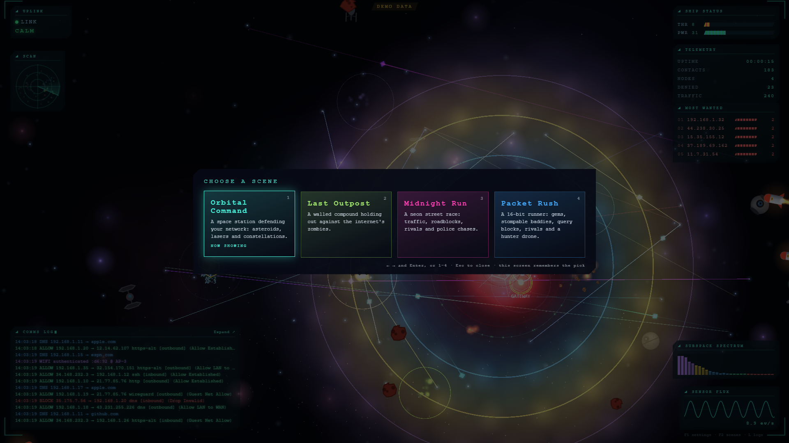

Press **F2** for the scene picker. Click a card, use the arrow keys and Enter,
or press 1–8; Esc closes it. The **Scene** dropdown at the top of the F1 panel
does the same. The screen fades out and loads the new scene.

The pick is saved in that browser, so a kiosk pointed at the plain
`http://<relay-host>:8080/` comes back to it after a reload or a reboot. You
never need to touch the URL.

You can also pick a scene by address. One relay serves every scene, so
different screens can show different scenes at once:

| URL | Scene |
|-----|-------|
| `http://<relay-host>:8080/` | this screen's saved pick, or else the relay's `default_theme` |
| `http://<relay-host>:8080/scifi/`, `/zombie/`, `/racing/`, `/rush/`, `/spy/`, `/mainframe/`, `/aquarium/`, `/gibson/`, `/mycelium/` | that scene (unknown names are a 404) |
| any URL + `?theme=racing` | that scene (handy on the Pages demo) |

The viewer checks the URL path, then `?theme=`, then the screen's saved pick,
then the relay's `/config.json`, and falls back to `scifi`. If the address names
a scene and you pick another one, the address is rewritten to match. Each scene
is its own bundle, so a screen only downloads the scene it shows.

### Log inspector

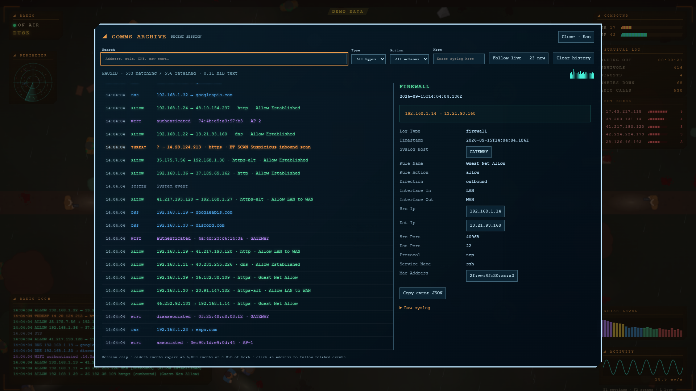

Press **L** or click **Expand ↗** on the log panel to open the inspector. The
scene and soundtrack keep running underneath. **Esc** closes it and **F1**
switches to settings. L works even when the compact log is hidden, and does
nothing while you're typing.

- **Search** retained fields and raw text, or filter by type, action and exact
  syslog host. Search applies 150 ms after you stop typing.
- **Select a row** for structured details, endpoint information, the raw syslog
  line (when there is one) and copy buttons.
- **Click an IP, MAC or host** in the details to follow matching events across
  event types. **Back**, the removable identity chip and **Reset filters** take
  you back. Matches use explicit event fields; the inspector doesn't guess which
  IPs belong to the same device.
- **Selecting a row or scrolling pauses** following. **Follow live** resumes,
  and the counter shows how many events arrived while paused. Arrow keys,
  Home/End and Page Up/Down move through the list.
- **History stays in browser memory**: at most 5,000 events or 8 MiB of event
  text, whichever comes first. Each event keeps at most 16 KiB of text, with
  structured strings capped at 512 characters and the rest used for raw syslog;
  truncation is marked in the details. These are text budgets, not limits on the
  browser's whole heap.
- **Pausing doesn't stop** ingestion or eviction. If a selected event expires,
  its details are released. **Clear history** empties the history and the
  compact log; reloading clears history and filters too. Only the relay's first
  snapshot seeds history, so a reconnect doesn't repeat events.

The compact log on the HUD keeps its one-line format, `[inbound]`/`[outbound]`/
`[internal]` tags, DHCP-learned hostnames and `×N` collapsing of repeats. It
reads from the same history as the inspector, so the two never disagree. The
inspector only mounts visible rows, refreshes at most ten times a second and
stops rendering when closed. Its sparkline covers the last 60 seconds, and
reduced-motion preferences turn off its animations.

### Settings (F1)


Press **F1** for the settings panel. Changes apply live and are saved in the
browser. The two renderer options, antialias and GPU power, apply after the
panel's **Apply & reload**.

| Tab | What's in it |
|-----|--------------|
| **Scene** | the scene's own toggles. Orbital Command: starfield, nebula, dust, ambient ships, DHCP planets, event stars, asteroids, attack rockets, crystals, IP constellations, ring objects, AP cores, screen shake, move with the music. Last Outpost: zombies, hordes, supply runs, couriers, DNS radio, DHCP arrivals, AP buildings, day/night, rain, blood, screen shake, move with the music. Midnight Run: traffic, roadblocks, police chase, rivals, DNS billboards, Wi-Fi gates, rain, camera nudge, move with the music. Packet Rush: gems, baddies, query blocks, rivals, checkpoints, hunter drone, rain and embers, turbo, boss fights, hero. Panopticon: signal arcs, tracking, satellites, uplinks, ripples, clouds and storms, grid, move with the music, eye of god, and how often the eye is tasked. Mainframe: packets, firewalls, worms and ICE, lookup towers, pick-and-place, antennas, floating addresses, move with the music, flight speed, dive into a chip, and how often it dives. Aquarium: schools, pufferfish, shark, bubbles, residents, treasure chest, light dimming on system log bursts, names and addresses, how many residents the reef holds, current, camera drift. The Gibson: face pulses, scrolling listings, tower rewrites, access banners, target lock, move with the music, scroll speed. Mycelium: growing hyphae, DNS blooms, DHCP sprouts, Wi-Fi spores, block scorch, threat blight, device labels, keeping the garden across reloads, hypha half-life, bioluminescence, and spore drift |
| **HUD** | each HUD panel on or off (names follow the scene), plus scanlines |
| **Audio** | see [Mixing](#mixing) |
| **Colour** | hue shift and intensity for the HUD accent; Orbital Command also recolours its host mesh (spectrum, event law, mono, warm, cool). Event colours never change |
| **System** | quality preset, render scale, FPS cap, the scene's budgets, antialias and GPU power, simulation speed, reset to defaults |

## Scenes

All nine scenes draw the same events with the same colours. Each has its own
HUD, sound and settings.

### Orbital Command


Your network is an orbital station. Hosts drift in as stars and grow into
constellations, blocked traffic comes in as asteroids the station shoots down,
and the whole thing rides a parallax nebula.

| Event | Colour | On screen |
|-------|--------|-----------|
| allow | green | crystals between the core and a device, star-to-star links, the inner ring |
| block | red | an inbound asteroid intercepted by the station's laser, with a shake and flash |
| dns | blue | a blue laser from the client to the station, the second ring |
| dhcp | yellow | a planet labelled with the client's hostname drifts across; the logging AP core ripples |
| wifi | purple | joins send a crystal from the AP core to the station; leaves and failures fire a laser back |
| system | grey | a grey shockwave from the station |
| threat | amber | an IDS/IPS attack rocket weaves in on an evasive path, is shot down near the station, and turns the core red while any rocket is alive |

Traffic volume sets the weather: **STORM** at 300 events per 30 seconds and
**HURRICANE** at 1200. The readout turns amber or red, the station flares and
the field fills with debris and intercept fire. Busy IPs grow into
constellations, and blocked destinations rank on the **MOST WANTED** board.

### Last Outpost


The same traffic as a walled compound seen from above: your network is inside
the walls, the internet is everything outside. The HUD is relabelled to match
(RADIO, COMPOUND, SURVIVAL LOG, HOT ZONES, RADIO LOG…).

| Event | On screen |
|-------|-----------|
| block | a zombie shambles in from a bearing fixed by the remote IP. The nearest tower guard turns and fires; rounds fly to it and it topples when they land. The odd one reaches the fence (a breach nudges the camera) |
| threat | a horde: a brute leading a weaving pack. The nearest towers open fire with bursts, the scene takes on a steady red cast and the floodlights turn red while the brute lives |
| allow (border) | supply runs: outbound, a scavenger runs from the camp through a gate and off the map; inbound, a survivor carries a crate in. Survivors step around zombies, and the towers shoot any zombie that gets close to one |
| allow (LAN↔LAN) | a courier strolls between two tents |
| dns | a dashed radio call from the client's tent to the mast, whose blue light warms with traffic |
| dhcp | a new survivor walks in through a gate and pitches a tent labelled with the device's hostname. Renewals ring the tent; names fade when a device goes quiet |
| wifi | AP and gateway hosts are buildings: joins walk in the door, leaves and failures hurry out, and the building's lamp warms toward its recent activity |
| system | the generator browns out: every light dims smoothly and recovers |

**The HUD is the outpost's own paperwork:** notes on hand-cut card taped to the
wall, stencilled headings, ammo-box gauges and a radio log on ruled paper.

**Dead country.** The ground and trees are drained to grey-brown, with old
bloodstains outside the walls. That happens once when the scene is built, so
it costs nothing per frame. Traffic weather is the time of day: CALM is an
overcast day, STORM is dusk with rain, HURRICANE is horde night with heavy
rain and thick fog. A cold gloom always deepens toward the screen edges.

**No flashing.** Every light and colour change in this scene eases over about
a second. Nothing strobes or blinks, and routine kills don't shake the screen.

**Move with the music** (on by default). Zombies shamble and bob in time with
the soundtrack, guards sweep their watch once every eight bars, the
floodlights breathe slowly with the music's loudness, the mast light swells on
each bar, and during a horde the red wash follows the heartbeat. The scene
keeps its own clock and eases toward the music's beat (never more than ±50%
speed), so a new song never makes anything jump. With the sound off it keeps a
steady walking tempo.

### Midnight Run


The network as a street race through a neon city at night, in real 3D
(three.js) with a chase camera. The road is straight; a curved-world shader
bends everything ahead of the car into sweeping corners and hills. Wet asphalt
reflects the street lights and taillights, and bloom makes the neon glow.
Everything is built in code: the car, the city, the signs and textures.

| Event | On screen |
|-------|-----------|
| allow | cars on the road: outbound traffic ahead that you pass, inbound traffic coming up from behind to overtake |
| block | a striped barricade across one or two lanes. Drivers swerve into a clear lane; anything that hits it smashes it (pieces fly), loses speed and gets knocked sideways |
| threat | a police chase: a black-and-white with a flashing red-and-blue light bar closes in and runs alongside until the heat dies down (see [Police](#police)) |
| dhcp | a rival appears up ahead with the device's hostname on a plate. You reel it in, race side by side, then it boosts away |
| dns | the next neon billboard over the horizon shows the domain, in DNS blue |
| wifi | a neon gate over the road labelled with the AP: a full arch for a join, a broken dim one for a failure |
| system | the street lights brown out in a wave rolling away down the road |

**Every event is a window.** Each live event lights one real window on a
building coming up ahead, in its event colour. The window eases on over about a
second, then fades over about fifteen, so a busy network paints the city in its
traffic while the ordinary warm and cool office lights stay underneath.

**Speed.** Traffic sets the cruising pace: about 100 km/h on a quiet network,
over 200 when it's busy. When your driver sees several seconds of empty road on
its line it sprints like a racer, up to about 85 km/h over cruise: a hard pull
through the low gears that tapers near the top, with a beat of lost drive at
every shift (watch the tach). When traffic closes in it lifts off and coasts
back down; it never brakes. Motion blur streaks the edges of the screen out
from the vanishing point as the speed climbs, while your car and the road ahead
stay sharp. A sudden burst lights the nitro: the camera pulls back, the field
of view widens, and blue flames and speed lines kick in. Traffic weather is the
rain: a dry (but always damp) night, then a wet storm, then a monsoon. Like
Last Outpost, nothing flashes except the police light bars.

**The dash.** The HUD is the car's instrument cluster, and every needle swings
on a spring. Nothing blinks.

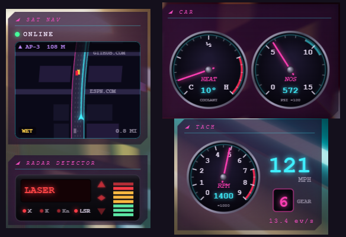

| Instrument | What it shows |
|------------|---------------|
| Sat nav | a heading-up moving map: the winding road with its neon curbs, city blocks, cross streets named after recent DNS lookups, every car (rivals yellow, police swaying red and blue, wrecks grey), roadblocks and gates, the route your driver is taking, the next gate or roadblock with its distance, the weather and the miles covered |
| Radar detector | an LED detector. Traffic lights up bands: X for DNS, DHCP and Wi-Fi, K for allowed flows, Ka for blocks, and laser for threats, locked on while the police are on you. It also has signal-strength LEDs and front, side and rear arrows (outbound, internal and inbound traffic) |
| Heat | an analog coolant gauge from C to H with a red zone (threat level) |
| NOS | an analog bottle-pressure gauge in PSI with a cyan sweet spot (network energy); it glows while the nitro fires |
| Tach | an analog tachometer on the car's real gear and revs with a redline, a digital MPH readout, the gear, and the event rate |
| Equalizer, race log, most wanted, police scanner | as in the other scenes, restyled |

**Physics.** Nothing drives through anything. Every car has a footprint,
momentum, sideways velocity, a heading and spin. Drivers follow the car
ahead, brake when a gap closes and only change lanes when the next lane is
clear. When cars touch (checked as oriented rectangles, sub-stepped so fast
cars can't pass through each other) they push apart and trade momentum, and an
off-centre hit spins them. A hard hit makes a car lose control: it spins out,
slides to the shoulder, scrubs to a stop and becomes an obstacle for everyone
behind it. Your car is never taken out; it gets knocked about, loses speed and
fishtails, then recovers. Sparks fly where metal meets metal, and every crash
is heard in place.

**There's always a path, and no brakes.** Your car has no brake lights, and it
never slows down for traffic. It holds its cruising speed or puts its foot
down, and a busy network makes it faster. Your driver plans in space and time.
About twelve times a second it tries around a hundred moves: any point across
the road (between lanes and along the curb included), up the curb onto the
sidewalk (dodging the street-light poles), each at cruising speed or with a
boost. It plays each one forward for two seconds against where every car will
be, using your car's real sideways grip and acceleration. Wrecks count as wide,
fast-slowing obstacles sliding for the shoulder. The best clean move wins. Lane
centres, the middle of the road and short moves are preferred (home is the two
inner lanes, where the action is), the curb is only an escape, and the sidewalk
is the last resort when the road is shut. The car hops the curb with a thump
and sparks, and gets back on the road when there's room. Hits barely cost it
any speed: the other car takes the shove.

When nothing is clean, your driver gets wild. It accepts tighter gaps (paint
gets traded), flicks across harder with the tail hanging out, gets heavier to
shove with, and leans on the horn. The cars in the way are asked to clear it:
an outside-lane car squeezes onto the curb so you can go by on the inside,
others change lanes, and if they can't they floor it. Rivals and police pace
themselves off your cruising speed, not your current speed, so if you're held
up they pull away instead of slowing into a moving wall. New traffic never
fills every lane at the same distance, and traffic keeps its own pace. How wild
your driver starts rises with the event rate: polite on a quiet network, a
battering ram on a busy one.

Measured headless over two minutes of demo traffic at 12, 20 and 30 events a
second, your car averages 99 to 104% of its cruising speed, never drops below
85% of it (only briefly, after a hard knock), and takes about 13 to 18 knocks a
minute.

<a id="police"></a>**Police.** Every IDS/IPS event gets its cop. If there's no
room behind you right away, it keeps trying for several seconds: other lanes,
further back, or pulling out ahead. A cop drives like a pursuit car. It's locked
to your real speed (sprints included), much quicker off the line, threads
through traffic while it's still behind the camera, and pulls out of a side
street ahead of you when you're flat out. It's built for contact, but your
driver can still wreck it.

### Packet Rush

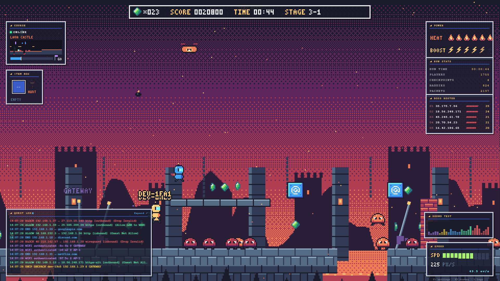

Your network as a 16-bit auto-runner. A little courier bot with a red scarf
races right through a course that's generated just ahead of it, in chunky pixel
art at a whole-number scale (the view is about 250 pixels tall). Everything is
drawn in code from pixel maps, including the 3×5 pixel font. There are no image
files.

| Event | In the game |
|-------|-------------|
| allow | green gems: outbound ones wait ahead in arcs and lines, inbound ones fly in from behind and bounce to rest |
| block | crawlers and hoppers to stomp; a burst of blocks puts a brick wall across the course, and the bot smashes straight through |
| threat | the hunter drone hovers ahead and drops bombs while the heat lasts; a sustained attack brings in a boss |
| dns | a floating query block; the bot headbutts it, the domain pops out in pixel letters, and a power-up drops: turbo shoes, a gem magnet or a shield bubble |
| dhcp | a rival runner wearing the device's hostname drops in, races alongside, then dashes off |
| wifi | a checkpoint antenna flag that rises with the AP's name as the bot passes (joins), or a bent, broken one (failures) |
| system | a power flicker rolls across the backdrop |

**Worlds.** Traffic weather picks the world: **Green Hills** on a calm network,
a rainy **Neon Factory** in a storm, and a **Lava Castle** with rising embers in
a hurricane. New ground is built in the new world, so the change rolls in from
the right while the parallax backdrop cross-fades. Traffic sets the run speed,
and a burst lights the turbo (speed trails).

**Autoplay.** The bot plans like Midnight Run's driver. About twenty times a
second it tries jumps (a hop or a full jump, now or a moment later, with or
without a second jump in the air) and flies each one forward through the
course, the baddies, gems, query blocks and falling bombs. It picks the one
that lands safely, preferring stomps, gems and blocks, and the smallest jump
that works. It never stops. The generator only builds gaps the bot can clear at
its current speed, and ledges forgive landing a few pixels low. A hit scatters
some gems (grab them back) with a soft shimmer instead of a blink. On the rare
miss into a pit, the bot bounces back out. Measured headless over 90 seconds of
demo traffic, it misses a jump about once a run or less and stomps around 50
baddies.

**Boss fights.** A sustained attack (three IDS/IPS threats inside half a
minute) brings in a boss: a hovering botnet mech named after the threat's
signature, with its name and hearts in a boss bar under the top bar. It keeps
ahead of you, then slams down and rolls packet orbs along the ground. That's
your chance: land on its dome while it's down. Three stomps and it bursts into
gems with a victory fanfare. A boss battle tune takes over the music for the
fight (unless you've pinned a tune). There's one boss at a time, and never more
often than about once a minute. Turn them off with **Boss fights** in F1.

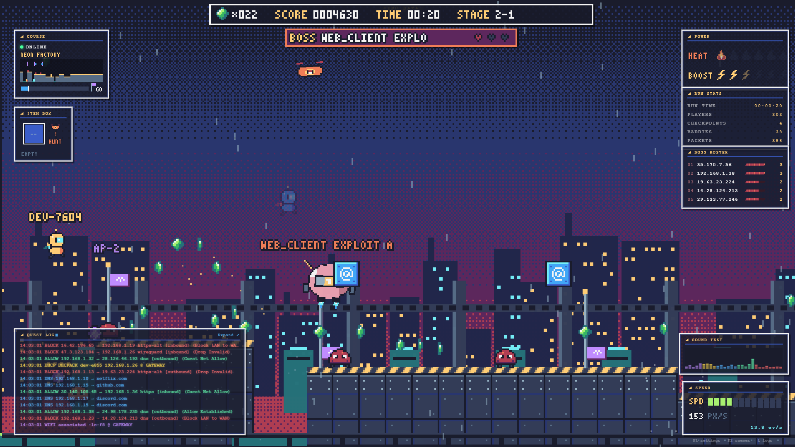

**Heroes.** Pick who runs in F1 → Scene → **Hero**: the courier bot with its
red scarf, a hacker cat in a hoodie with its tail streaming behind, or a ghost
with a rippling hem. It switches live.

**The dash** is a 16-bit game's HUD, drawn in the pixel font. A top bar shows
gems, score (it counts up), time and stage. The course panel is a mini-map of
the ground around you with baddies, rivals, query blocks and flags on it, plus
a stage progress bar to the goal. The item box shows the power-up that's running
and its time left, and a breathing HUNT warning while the drone is after you.
Heat and boost are rows of flames and bolts, and speed is a segmented meter.
Every three minutes a **STAGE CLEAR** card slides in with the stage's gems,
stomps, blocks, bricks, checkpoints and most-visited site.

### Panopticon


Your network as a planet under watch. It isn't Earth. The continents,
mountains, deserts, ice caps and weather are generated on the GPU from a seed,
and the world has its own nations and cities with made-up names. Every outside
IP has a home on it: its first two octets pick the nation, so an address range
clusters in one place, and the whole address picks the city. Your network is
the ground station. The planet turns slowly under a fixed sun, so the day/night
line sweeps across the city lights, and clouds drift over it and cast shadows.
Traffic weather is the **DEFCON** level: 5 on a calm network, 3 in a storm and
1 in a hurricane, with heavier cloud and a warm cast creeping in at the edges.

| Event | On the planet |
|-------|---------------|
| allow | a green signal arc along the great circle between your ground station and the other end's city |
| block | a red arc that's cut off mid-flight, with a ring where it was stopped |
| threat | an amber tracking marker on the attacker's city, labelled with its IP, and an arc home |
| dns | a blue downlink from the nearest satellite to the ground station |
| dhcp | a new device launches a satellite into orbit, labelled with its hostname; renewals send it a beam |
| wifi | access points orbit as satellites with a dish: a join sends a purple beam down, a failure a crackling red one |
| system | a ripple through the atmosphere from the ground station |

**The eye of god.** Every so often the eye tasks a target. It happens when
enough IDS/IPS threats land inside a minute (3 by default), when one address
racks up 12 blocks in a minute, or on a random sweep about every 2 minutes, so
even a quiet, well-behaved network gets regular visits. The first tasking comes
15 to 20 seconds after the page loads, and there's a rest of up to 45 seconds after
each one. A run lasts about 30 seconds:

1. **Acquire.** The camera swings round until the target is under it, and a
   reticle closes in over ticking coordinates and altitude.
2. **Dive.** Down through the atmosphere and into the cloud deck.
3. **Enhance.** Out of the cloud above a small scene, blocky at first and
   sharpening in steps (ENHANCE ×2, ×4, ×8) as a scan line sweeps.
4. **Identify.** Boxes lock onto the people, vehicles and objects, with
   confidence scores that climb. A dossier types itself out: the target IP, the
   signal, the IDS signature or firewall rule, the district, city and nation,
   coordinates, contacts in the last minute, first seen, and what they're up
   to. Then **TARGET IDENTIFIED** eases in.
5. **Release.** Back into the cloud and up to orbit. The target stays marked
   for a minute.

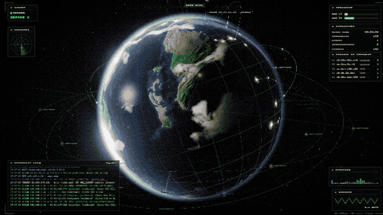

The eye catches people doing one of eight things. It never shows the same one
twice in a row:

- a briefcase swapped for an envelope between two cars in an empty car park
- someone climbing out of a lit bedroom window, down the drainpipe, along the
  hedge and over the fence to a car waiting with its lights off
- someone hiding behind a dumpster while a patrol car's searchlight sweeps the alley
- two people meeting on a rooftop, where an envelope changes hands before one of them goes down the fire escape
- a bag thrown off the end of a pier
- two people carrying a crate out of a warehouse into a van backed up to the loading dock
- papers fed into a burning barrel behind a building
- a lookout on a street corner signalling a car, which pulls over for a moment
  before speeding off

How it looks depends on the time of day at the target. In daylight you get
satellite imagery; at night you get night vision or thermal. The scenes that
only make sense in the dark switch to thermal when the target is in daylight.

| Night vision | Thermal | Daylight |
|---|---|---|
|  | 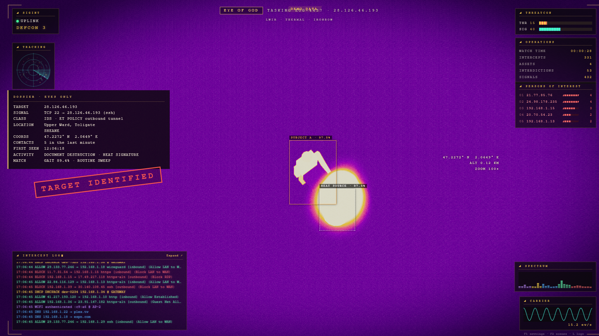 | 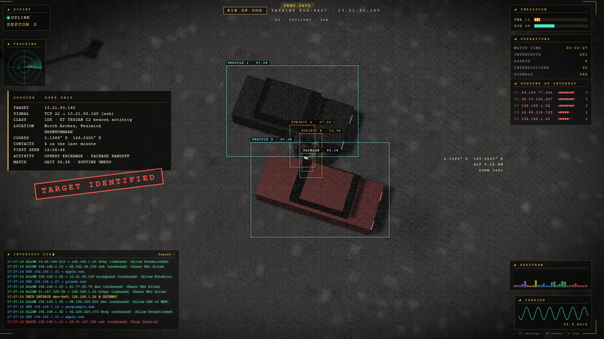 |

Everything is built in code: the planet and its city lights, the satellites,
the nine scenes and every person in them. Nothing flashes: the enhance steps,
scan lines, boxes and stamp all ease in. In F1 → Scene, **Eye of god** turns
the taskings off, **Eye: threats in a minute** sets the threat trigger, and
**Eye: random sweep every (min)** sets how often a random sweep comes round
(as often as every 30 seconds).

### Mainframe


A god's-eye flight over a big, busy circuit board at night, in the spirit of
*Hackers*, while your network races along its traces. The board is generated in
sections ahead of the camera: a near-black teal solder mask where the copper
itself glows, cyan streets of parallel traces running the length of the board,
cross streets running its width, gold pads and vias, faint silkscreen outlines
and part numbers, and text taken from your own traffic (addresses, hostnames,
domains, rule names). The parts on it are 3D: dark chips with pins and softly
lit, laser-etched lids, capacitor towers, heat sinks, spinning fans, headers,
crystals and LEDs. The board carries on to either side and fades into a teal
haze at the horizon.

The camera looks steeply down, so the board is laid out below like a map. It
slides slowly between the ten streets, barely banks, drifts a little in
heading, breathes up and down, and climbs over the tall parts. Between events
the board keeps up a chatter of short bolts of light, so it's never still, and
addresses drift up through the air.

| Event | On the board |
|-------|--------------|
| allow | short green bolts racing along the traces: outbound races ahead from behind the camera, inbound comes at it. Some turn off down a branch into a chip, and some take a hard turn at a junction, run along a cross street and turn off down another street |
| block | a red pulse runs at a firewall chip and shatters on its pins |
| threat | a worm: a glitching chain crawling along a trace toward a chip, which glows amber. ICE launches from the chip and hunts it down, and the worm breaks apart |
| dns | a blue pulse reaches a lookup tower, and the domain scrolls across the tower's LED lid |
| dhcp | a pick-and-place arm lowers a new part into an empty socket, labelled with the device's hostname |
| wifi | rings spread from a printed antenna: wide purple ones for a join, short red ones for a failure |

**The HUD is a rack of instrument modules:** graticule faces behind cyan
hairline frames, solder pads at the corners, LED bargraphs and a serial console.

Traffic weather is the board's load: **NOMINAL** on a calm network, **HEAVY
LOAD** in a storm (faster traffic, a little faster flight), and **OVERCLOCK** in a
hurricane, where the light turns orange, the fans spin up and the packets run
hot.

**Diving into a chip.** It runs on the same schedule as Panopticon's eye of god:
enough threats inside a minute, one address hitting 12 blocks in a minute, or a
random dive about every 2 minutes. A dive lasts about 30 seconds and tells a
short story: something got in, we find it, and we deal with it.

1. **Lock.** A chip up ahead is tasked. Its lid is re-etched with the
   target's address, it glows, and the camera lines up on it.
2. **Descend.** The camera swoops down onto the chip, and the lid lights up
   with the gold die underneath.
3. **Through.** A gold lattice rushes past as the camera falls through the
   silicon.
4. **Inside.** A low flight over the die itself: rows of standard cells,
   memory macros and copper buses. Red corruption spreads over the die while
   the intruder's traffic streams amber, and a traceroute to the target types
   itself out hop by hop, followed by the signal, IDS signature or firewall
   rule, and contacts in the last minute. **INTRUSION TRACED** eases in.
5. **The counter-measure.** One of three, picked at random each dive, with a
   status line saying what's happening:
   - **Purge.** ICE floods the buses and a cyan wave sweeps across the die,
     turning the corruption clean. **THREAT PURGED.** Climbing back out, the lid
     reads SECURED and a cyan shockwave rings out across the board.
   - **Quarantine.** Hazard-striped blast doors drop across the buses one after
     another, and the intruder's traffic shatters against them; the corruption
     stops spreading. **QUARANTINED.** Climbing back out, the lid is sealed with
     hazard stripes and red firewall walls rise around the chip, where they stay.
   - **Counter-strike.** The trace locks onto the source and a counter-strike
     launches back up the line as the corruption drains away. Instead of climbing
     out, the camera chases the strike out of the chip, along its trace and away
     down the attacker's street. The route catches fire right behind the strike
     and cools to embers as the camera flies over it.
     **SOURCE BLOCKED.**
6. **Back to the flight.** Every ending finishes exactly where the flight
   carries on, at cruising height and speed, so there's no jump.

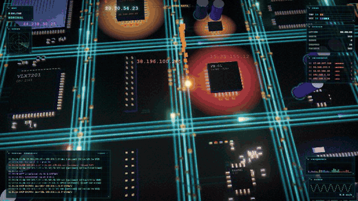

| Descending onto the chip | Inside the chip |
|---|---|
| 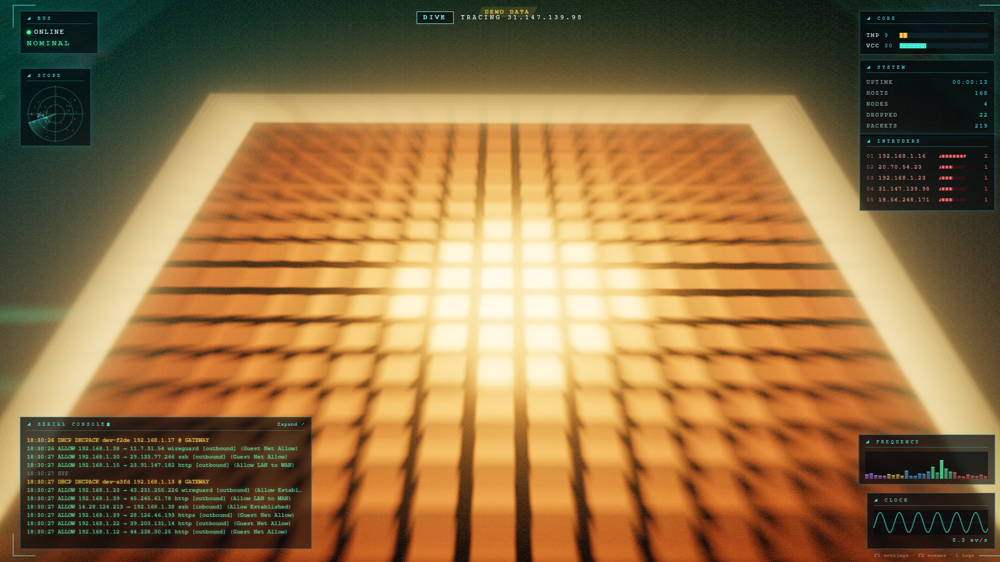 |  |

The traceroute is made up (plausible carriers and latencies, the same for the
same address), because pewpew never sends anything onto the network. Nothing
flashes: the glows, lattice and stamp all ease. In F1 → Scene, **Dive into a
chip** turns dives off, **Dive: threats in a minute** sets the threat trigger,
**Dive: random every (min)** sets how often a random dive comes round, and
**Flight speed** sets how fast the camera flies.

### Aquarium


A reef tank in real 3D, in the spirit of the old marine aquarium screensavers.
Sunlight comes down through a rippling surface in slow shafts and throws
moving caustics over the sand, the rocks, the coral and the fish. The water
turns bluer and murkier with distance, and specks drift past in the current.
The reef is live rock crusted with coralline algae and polyp colonies,
branching, brain and table coral, sea fans, tube sponges, an anemone with a
pair of clownfish, seagrass, and a stand of kelp in the murk, all swaying with
the water. An air stone never stops bubbling. The camera drifts very slowly
around the reef. The HUD reads like a reef tank controller: stress and oxygen
gauges, water readings, predators, reef life, the current and a fish finder.

The fish swim like fish: a wave runs down the body toward the tail, faster the
faster they go, pectoral fins scull when they hover, bodies bend into their
turns, and turns are real 3D turns rather than flips. They steer smoothly,
keep out of each other's way and stay off the reef. A green chromis school
lives on the reef, and a few residents (a yellow tang, a regal tang, a queen
angelfish and a butterflyfish) wander it from the start, so the tank is never
empty.

| Event | In the tank |
|-------|-------------|
| allow | a school of green chromis swims across: outbound left to right, inbound right to left. Busier traffic makes bigger schools, and the first fish carries an address it talked to |
| block | a spotted pufferfish swims up to the front, swells up with its spines out at the blocked address, holds, deflates and swims off |
| threat | a reef shark cruises through with the attacker's address and the IDS signature. Every small fish near it scatters, and a warm amber light eases into the water while it's there |
| dns | a burst of blue bubbles rises from the air stone, with the domain riding the biggest one up to the surface |
| dhcp | a new resident (a tang, butterflyfish or angelfish) swims in with the device's hostname and stays on the reef. When the reef is full, the oldest newcomer swims away |
| wifi | the treasure chest creaks open with a warm glow and a stream of purple bubbles for a join; for a failure its lid pops up and slams shut |
| system | gateways and APs log system lines constantly, so single lines don't do anything. A burst well above your network's usual rate (a reboot or a re-provision, say) dims the tank light, which slowly comes back. At most once every two minutes |

Traffic weather is the water: **CALM WATER** on a calm network, **CHOPPY** in a
storm, and **RIP CURRENT** in a hurricane, where the current pulls harder, the
kelp and grass lean over, the fish swim faster, the surface churns and the
water turns murky.

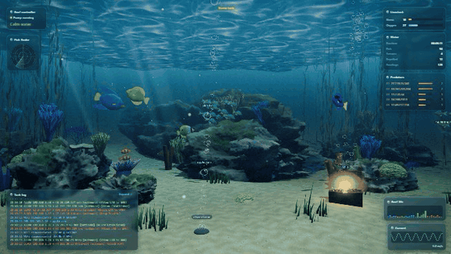

| The chest opens for a Wi-Fi join | A shark cruises through |
|---|---|
| 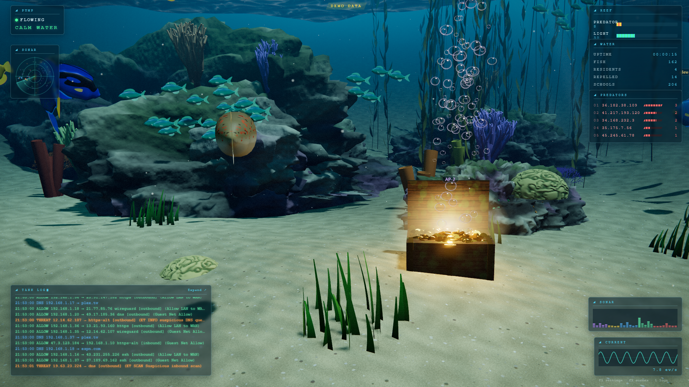 |  |

Everything in the tank is generated in code when the scene loads: the fish are
painted in side view and wrapped onto 3D bodies, and the rock, coral, kelp and
sand are shaped from noise. In F1 → Scene, each event's fish or effect can be
turned off, **Residents on the reef** sets how many residents stay before the
oldest leaves, **Current** scales how much the water moves, and **Camera
drift** stops the camera.

### The Gibson


The storage wall from *Hackers*, rebuilt in 3D as a computer city: a lattice
of tower blocks with streets in both directions, all standing still in true
world coordinates while the camera flies the streets — gliding straight down
most blocks and carving a long, sweeping ninety-degree arc at about every
other intersection, banking like a patrol car, rising and falling as it
goes, exactly like the film's flythrough. The translucent monoliths are
always standing, and their faces are covered in glowing listings set in
neat digital boxes — and those listings are your own log stream: the
addresses, domains, hostnames and services from live traffic, each drawn in
the color the comms log gives that kind of message (green allow, red block,
orange threat, blue DNS, yellow DHCP, violet Wi-Fi), with hex and binary
filling in around them. Long hostnames shrink to fit their box. The streets
are wired like a circuit board, with energy pulses racing down the copper
toward you, and ACCESS GRANTED / ACCESS DENIED signs hang on a tower face
and pulse. When the wall gets busy it flies faster.

| Event | On the wall |
|-------|-------------|
| allow | a pulse of light climbs the nearest face, and the address joins the listings in green |
| block | a tower burns red for a moment, an **ACCESS DENIED** sign pulses on a face, and the address joins the listings in red |
| threat | a tower is flagged red and the camera swings around to lock onto it — reticle, `TRACKING · <attacker>` readout, the wall slows to a crawl, and the file is stamped **INTRUSION TRACED** as the lock releases |
| dns | the domain joins the listings scrolling down every face, in blue |
| dhcp | one far tower rewrites itself, with the device's hostname in its listings in yellow |
| wifi | a join gets a **PASSWORD ACCEPTED** sign and a bright face pulse, with the access point in violet; a failure flashes one red |
| system | nothing on the wall; the music hears it |

Traffic weather is the load on the wall: **STANDBY**, **PAGING** in a storm and
**FLOOD** in a hurricane, where the scroll speeds up and the fog closes in.

The listings, the traces and every tower are generated in code; no textures
ship with the scene. In F1 → Scene, each event's effect can be turned off,
**Target lock (threat)** turns the camera lock off, and **Scroll speed** scales
the pace of the patrol.

### Mycelium


The network as a forest floor seen from close above, at night, drawn entirely
in code — and the floor is alive before a single packet moves. From each host
nodule, hyphae grow: fine filaments that wander the loam in gentle arcs,
branch, and *fuse* with other networks where they cross (anastomosis),
weaving a mat of loops and junctions that slowly colonises the whole screen.
Traffic never builds the web — it feeds it. Permitted flows send a pulse of
light that walks a real path across the existing mat, brightening the
filaments it passes; habit makes well-used routes the paths of least
resistance, so light keeps taking the roads your traffic already wears.
Traffic out to the internet sends warm light running toward the edge of the
known along whatever roads reach that way; where the mat hasn't arrived yet,
growth reaches out instead. Each host's network grows in its own family of
the palette — ice cyan, teal, spring green — so the fused mat reads as a
tapestry, and the light itself is tinted by protocol: gold for https and
wireguard, ice blue for ssh, pale violet for dns. Every growing tip is drawn
as a live, swaying hair of light, so the frontier of the mat is always
moving.

| Event | On the floor |
|-------|--------------|
| allow | a pulse of light runs the filament path between the two hosts; a route used often becomes the preferred road for next time. Where no path exists yet, a new hypha grows toward the unreachable host |
| block | a scorch patch smoulders in — wounded ground filaments refuse to re-enter — with an ember flare, and heals away over twenty seconds |
| threat | a crimson blight swarm crawls in from a screen edge toward the brightest host, and the web flares white and burns it off while the music swells |
| dns | a pale mushroom pushes up at the busiest nearby junction, with the domain on its stem, glowing cream, wilting after half a minute into a puff of spores that seed new growth where they land |
| dhcp | a new host takes root with a warm ring and a rising glass tone, labelled with its hostname, and puts out its first filaments |
| wifi | joins emit a drift of spore light from the access point; failures scatter dimly |
| system | a grey ring breathes out from the gateway nodule |

**The garden keeps growing.** The mat is persisted to the browser, so the
scene you see today is the one your network grew. Time works on it in
minutes: each filament's memory fades toward a faint ghost trace (half-life
20 by default) that never vanishes — so the mat you established yesterday is
still the ground traffic runs on — while live traffic rides it as flares and
travelling light that come and go in seconds. Neglected ground slowly gives
way to new exploration at the edges, well-trodden roads stay bold, and
nothing ever bakes in. **Keep the garden** (F1 → Scene) turns persistence
off.

**The HUD is the organism's own field notes:** CLIMATE (the weather, from
STILL to a storm), COLONY gauges (BLT blight, VIG vigour), FIELD NOTES,
GREATEST HUBS and FIELD RECORDS, all in soft rounded glass with spore-dot
corners.

## Sound

All sound is synthesized in the browser with the WebAudio API. Browsers only
allow audio after a click or keypress, so click once to start it. Each scene
has its own soundtrack and its own event sounds, and every scene can play an
uploaded [background track](#background-tracks) instead.

### Orbital Command's soundtrack

Six styles take turns, every 6 minutes by default:

| Style | Sound |
|-------|-------|
| Neon cruise | synthwave: four-on-the-floor, octave bass (Am–F–C–G), gated snare, a saw hook, arps when it's busy |
| Blade cosmos | slow brassy swells over a sub (Dm–B♭–C–Am, dorian), cold bell arpeggios with long echoes, taiko at night |
| Stellar organ | a pipe-organ ostinato climbing through the chord (Am–F–C–Em) over a ticking clock, a choir when it's busy |
| Arcade | a chiptune shooter at 138 bpm: square bass, noise drums, arpeggios and a pentatonic riff |
| Deep drift | a drone gliding between chords in E lydian, slow swells, pulsar pings in three-over-four |
| Fleet battle | a string ostinato, brass stabs and taiko drums (Dm–B♭–C–A) |

**Classic band** in the Music menu brings back the original generative band:
a set list of four melodies with song form (intro, verse, chorus, bridge,
outro), per-device voices, and a low drone while a threat rocket is alive.

The station's sounds play along, on the beat and in key:

| Event | Sound |
|-------|-------|
| asteroid intercepted | a defense laser diving onto a chord tone, then an explosion with a ring in key |
| threat | a rocket launch; its interception is a bigger blast. While rockets are alive, a shield thump every two beats and a red-alert tone every four bars |
| impact on the core | a big blast and a boom |
| block | a low sonar ping as the asteroid appears |
| allow | traffic plays the melody on the style's lead (saw, bell, organ, chip or glass) |
| dns | a soft high ping |
| dhcp | a warp-in whoosh onto a note as the planet arrives |
| wifi | rising pings for a join, a falling zap for a leave or failure |
| system | a shockwave: a low tone sweeping a filter open and shut |

The station hums and space hisses underneath, with radio crackle in storms.
**Move with the music** (Scene tab) makes the core breathe on the beat and the
stars and dust drift faster when the music is loud.

### Last Outpost's soundtrack

Six styles take turns, every 6 minutes by default, crossfading between them:

| Style | Sound |
|-------|-------|
| Horror synth | a pulsing minor ostinato (Am–F–Dm–E) over a saw drone, cold bells, a choir at night |
| Lonely survivor | fingerpicked guitar and a slightly detuned piano (Dm–B♭–F–C) over the wind, a cello at night |
| 80s slasher | driving octave bass (Em–C–Am–B), drum machine with a big gated snare, a brassy saw hook |
| Dark ambient | a breathing drone gliding between chords, distant swells, scraping metal |
| Dead west | banjo rolls, a bowed fiddle drone, boot stomps and a slide guitar (E dorian) |
| Broken lullaby | a music box on warped tape in 3/4 (Cm–A♭–Fm–G), glass harmonics, whispers at night |

The compound's sounds are part of the band. Each is snapped to the beat and
pitched to the chord that's playing:

| Event | Sound |
|-------|-------|
| guards fire | a punchy rifle shot with a ring in key; a brute's burst lands as a roll |
| block | a zombie groan on the chord root |
| threat | a horde roar and a boom; during the attack, a heartbeat and swells into every fourth bar |
| allow | traffic plays the melody on the style's lead instrument |
| dns | a radio chirp |
| wifi | a door creaking open (join) or shut |
| dhcp | a strummed music-box chord |
| system | the generator sputtering |
| breach | a boom and a metal clang |

Night thickens the arrangement (sixteenths instead of eighths, drums, choir
or cello). Wind is always there and rain comes in with the weather. Effects go
through their own limiter, so a busy night stays punchy without clipping.

### Midnight Run's soundtrack

Seven styles take turns, every 6 minutes by default:

| Style | Sound |
|-------|-------|
| Tokyo drift | a written song, not a generator: Tokyo street-racing hip-hop at 130 bpm in B♭ minor. Every hit is a one-16th staccato wall of stacked brass and saws across three octaves on a syncopated 3-3-2 grid, and the arrangement stacks layers as it builds (drums at bar 8, the full stack at bar 16). Claps and 808s, a whistle topline, crowd "hey!" shouts, koto, taiko, scratches and a gong fill it out, in a 32-bar loop. Chords, topline and every part are original |
| Street breaks | big-beat breakbeats at 132 bpm, a squelchy acid bass line, supersaw stabs when it's busy |
| Night drive | slow synthwave (Em–C–A–D): octave bass, arpeggios, a saw lead melody |
| Liquid DnB | 172 bpm rollers, a reese bass and airy seventh-chord pads |
| Chrome riff | drop-D palm-muted power chords through a distortion curve, a heavy backbeat |
| Trap lights | half-time 808s that slide between notes, hi-hat rolls, a bell line |
| Eurobeat rush | four-on-the-floor, offbeat octave bass, supersaw riffs |

The car is part of the band:

| Event | Sound |
|-------|-------|
| driving | an engine note pitched to the chord that climbs through each gear with speed; shifts wait for the beat and land with a turbo blow-off |
| nitro | a whoosh and a roar as it lights |
| collisions | a metal crash ringing in key for hard hits, a panel knock for light bumps, heard where they happen |
| boxed in | a long lean on the horn |
| block | a horn honking a fifth |
| threat | a soft siren wail across two chord tones while the police are on you |
| dhcp | a rival's engine revving past |
| allow | traffic plays the melody on the style's lead |
| dns / wifi / system | a radio chirp / rising pings / a power-grid shockwave |

Road roar rises with speed and rain comes in with the weather. **Move with the
music** (Scene tab) makes the curb neon and your underglow swell on every bar.

### Packet Rush's soundtrack

A chip band built for this scene: pulse waves at the classic 12.5%, 25% and 50%
widths, a triangle bass, noise drums and fast arpeggio chords. Five original
tunes and a boss theme:

| Tune | Sound |
|------|-------|
| Green hills | a bouncy overworld |
| Airship march | a jaunty march |
| Underground | an echoing minor cave tune |
| Factory rush | driving, with 32nd-note arps |
| Castle siege | harmonic minor |
| Boss battle | takes over during a boss fight |

Melodies are written in phrases: a motif, the motif with a twist, a
contrasting line, and the motif coming home to the tonic. They're rewritten
every couple of loops. By default the music **follows the world**: hills,
airship and underground take turns on a calm network, the factory plays in a
storm and the castle in a hurricane. You can also rotate or pin a tune.

Sound effects fire the instant things happen and are pitched to the tune's key:

| Event | Sound |
|-------|-------|
| jumps | a boing, and a higher one for the double jump |
| gems | chimes that climb the scale while you chain them |
| stomps, bricks | a stomp; a brick crunch |
| query blocks | a block bump, then a power-up run |
| checkpoints | a fanfare on the beat |
| drone | a two-tone warning while it hunts you, a falling bomb whistle and the blast |
| boss | its slam, rolling orbs, hits, and a victory fanfare |

### Panopticon's soundtrack

Five styles take turns, every 6 minutes by default:

| Style | Sound |
|-------|-------|
| Cold war | a 92 bpm analog ostinato in D minor over sub octaves, rim clicks and a slow pad |
| Signal intercept | 118 bpm glitchy electronica: syncopated kicks, gated hats, glassy chords and stray blips |
| Deep cover | a 70 bpm drone gliding between chords, sonar pings, a sparse detuned piano, and a heartbeat when tension rises |
| Zero day | 128 bpm industrial: four-on-the-floor, an off-beat reese bass, claps, and metal scraping on metal |
| Dead drop | swung 138 bpm spy jazz: walking bass, brushes and ride, vibraphone comping, and muted brass stabs when it gets tense |

The operation plays along:

| Event | Sound |
|-------|-------|
| allow | traffic plays the melody on the style's lead |
| block | a short interdiction tick |
| threat | a two-tone lock-on |
| dns | a burst of data chirps |
| dhcp | a launch rumble |
| wifi | rising pings (radio static under a background track) |
| system | a shockwave |
| eye of god | sonar pings while it acquires, a rising rush on the dive, digital blips at each enhance, teletype clicks while the dossier types, a tone as each box locks, a low stamp for TARGET IDENTIFIED, and a falling whoosh on the way out |

The music drops to half volume while the eye works. An operations-room hum sits
underneath, with radio static that rises with the DEFCON level.

### Mainframe's soundtrack

Five styles take turns, every 6 minutes by default:

| Style | Sound |
|-------|-------|
| Acid trace | 126 bpm acid house: a squelching, sliding 303 line with a filter that sweeps across the bars, four-on-the-floor kicks, claps and open hats |
| Phreak breaks | 136 bpm breakbeat: a hoover stab diving into each chord, rave piano, a pulsing bass |
| Deep dive | 138 bpm trance: offbeat bass, pluck arpeggios, a wide pad, gated supersaw chords when it's busy |
| Jungle bus | 170 bpm jungle: chopped snares, a rolling reese bass, an 808 sub at night, scratches |
| Handshake | 100 bpm electro: syncopated 808s, a robotic square-wave riff, modem-like noise sweeps |

The board plays along:

| Event | Sound |
|-------|-------|
| allow | traffic plays the melody on the style's lead |
| block | a glassy shatter in key as a firewall stops the packet |
| threat | a glitch stutter as the worm crawls in; ICE chirps, and a small blast when the worm dies |
| dns | a data chirp from the lookup tower |
| dhcp | the pick-and-place servo whirring down, and a click as the part seats |
| wifi | rising pings for a join, a crackle for a failure |
| dive | a lock-on tone, a rising rush on the way down, a whoosh through the die, ticks as the traceroute types, and a big hit for INTRUSION TRACED. Then the ending: a bright wash sweeping out for a purge, heavy slams as the blast doors land and a low two-note seal for a quarantine, or a rising zap as the counter-strike launches and a long rush as the camera chases it. The payoff (THREAT PURGED, SOURCE BLOCKED) lands with a hit and a chord, and climbing out has a rising whoosh |

The music drops to half volume during a dive. Fans hum and the board buzzes
underneath, louder when it overclocks, and the rush of air rises with the
flight speed.

### Aquarium's soundtrack

Four styles take turns, every 6 minutes by default:

| Style | Sound |
|-------|-------|
| Lagoon | 80 bpm lounge: soft electric piano chords, a round bass, a rim click |
| Tidepool | 96 bpm bossa: plucked patterns that change every few bars, a shaker, a soft pad |
| Kelp dub | 70 bpm dub: echoing chord stabs, a deep sub bass, a lazy snare |
| The abyss | 58 bpm ambient: slow pads, glass notes, a far-off choir |

The tank plays along:

| Event | Sound |
|-------|-------|
| allow | traffic plays the melody on the style's lead, and a school swishes past |
| block | a swelling tone as the pufferfish inflates, and a sigh as it lets go |
| threat | a low cello swell as the shark arrives, with a slow heartbeat while it's in the tank |
| dns | bubbles blipping upward in key |
| dhcp | a glass chime for the new resident |
| wifi | the chest creaking open with a bell chord, or creaking and banging shut |
| system | a sinking tone when the light dims |

The pump hums, the water moves louder in rough weather, the air stone blips
now and then, and bubbles pop softly at the surface.

### The Gibson's soundtrack

Four styles take turns, every 6 minutes by default:

| Style | Sound |
|-------|-------|
| Factory floor | 128 bpm techno: four on the floor, offbeat hats, a rumbling bass, metal clangs off the racks |
| Modem dial | 110 bpm electro-industrial: 808s, a square riff, glitch stutters, a carrier sweep |
| Nine volt | 140 bpm EBM: a gated reese, driving snares, a distant siren |
| Dead pixels | 92 bpm dark downtempo: a long drone, sparse kicks, tape hiss |

The wall plays along:

| Event | Sound |
|-------|-------|
| allow | traffic plays the melody on the style's lead, and a soft tick as the pulse climbs a face |
| block | the denial crackle with a falling tone |
| threat | two rising lock-on tones and a sweep as the camera swings out, and a big hit with a chord when the file is found |
| dns | a blip in key as the domain joins the listings |
| dhcp | a servo whirr and a click as the tower rewrites itself |
| wifi | a bell chord for a join, the crackle for a failure |
| system | nothing; the band carries it |

Server hum and static hiss underneath, louder in heavy traffic.

### Mycelium's soundtrack

No beat grid: free ambient. A slow drone breathes through a four-chord cycle
(Am F C G, gliding, one chord every forty-odd seconds) under an undergrowth
bed of wind that deepens with the weather, and a sparse soloist rings bell
sentences out of the current chord.

| Event | Sound |
|-------|-------|
| allow | a soft low pluck in the pentatonic, panned to the host |
| block | a muffled earth thud |
| threat | two swelling semitones of dread as the blight arrives, a slow heartbeat while it crawls, and a bright crack with a bell when the web burns it off |
| dns | a high glass bell |
| dhcp | a warm glass for the new host taking root |
| wifi | a short ping, high as spore light |
| system | one low bell with long reverb |

Bloom, sprout, scorch and heal each have their own small sound. Everything
is deliberately sparse: a quiet network is mostly wind and drone.

### Background tracks

Play your own music in any scene. In F1 → Audio → **Background track**, upload
an MP3, OGG, M4A, WAV or FLAC file. It's stored on the relay, so every screen
can use it: pick a track per scene, and every screen showing that scene plays
it within about 20 seconds, the kiosk included.

- When a track loads, the viewer works out its **tempo, beat position and key**
  (in a background worker, once per track) and saves the result on the relay.
  The panel shows what it found; type a tempo to correct it, or **Re-detect**.
- While a track plays, it's the only music. The scene's generated soundtrack
  steps aside, and so does every event sound that's really a note: pings,
  chirps, arpeggios, music-box strums, gem chimes and drum pulses. Real sound
  effects stay, locked to the track's beat: gunshots, groans, lasers, blasts,
  crashes, horns, stomps and the engine, which stops following the chords and
  sits lower in the mix. Music-driven visuals follow the track's beat and loudness.
- **Track volume** sits under Space & balance. Choose **None** to go back to the
  scene's own soundtrack, or delete the track from the relay.

The relay API behind it, handy for scripting:

```bash
curl -F file=@mytrack.mp3 http://<relay-host>:8080/api/tracks          # upload
curl http://<relay-host>:8080/api/tracks                               # list + assignments
curl -X PUT -H 'Content-Type: application/json' \
  -d '{"theme":"racing","name":"mytrack.mp3"}' http://<relay-host>:8080/api/tracks-assign
curl -X DELETE http://<relay-host>:8080/api/tracks/mytrack.mp3         # delete
```

A track assigned without analysis (for example, uploaded with curl) is analysed
by the first screen that plays it. Background tracks need a relay, so they
aren't available on the GitHub Pages demo.

### Mixing


The **Audio** tab is shared by every scene:

- **Melody** and **Devices** are layers that add together: the music, and the
  sounds triggered by events.
- Every event type has a **volume** (how loud) and a **gate** (how often it
  sounds, from 0 = never to 1 = every time). Gates thin a busy stream without
  changing its level.
- **Noise (chaos)** fires a short sound on a fraction of *raw* events, straight
  from the feed. 0 is off, 1 is every event.
- **Reverb**, **echo** and **Music bed** (music against event sounds).

Each scene adds **Music** (rotate, or pin one style; Orbital Command also has
Classic band and Packet Rush can follow the world), **Rotate every (min)**, and
two volumes of its own:

| Scene | Volumes |
|-------|---------|
| Orbital Command | **Lasers & blasts**, **Station hum** |
| Last Outpost | **Gunfire**, **Wind & rain** |
| Midnight Run | **Engine & nitro**, **Road & rain** |
| Packet Rush | **Game sounds**, **Rain** |
| Panopticon | **Surveillance sounds**, **Room & static** |
| Mainframe | **Board sounds**, **Fans & buzz** |
| Aquarium | **Tank sounds**, **Pump & water** |
| The Gibson | **Access sounds**, **Hum & static** |
| Mycelium | **Bells**, **Undergrowth & drone** |

Each scene keeps its own choices.

## Performance and quality

The relay never renders anything: each browser draws the scene on its own GPU.
How smooth it runs depends on the device *viewing* it, and a quality tier
bundles every setting that trades looks for frame time.


- **Auto** (the default) guesses a tier at load, then watches the real frame
  rate. Software renderers, Pi and phone GPUs, and browsers without WebGL
  start at Low. Touch devices, machines with ≤4 cores or ≤4 GB of memory, and
  Intel HD/UHD graphics start at Medium. Everything else starts at High. If
  frames stay under 75% of the target for 5 seconds, Auto drops one tier. It
  never steps back up, so it can't flap, and the System tab says which tier
  it's running and why.
- **If the GPU gives up**, the browser drops the scene's WebGL context and the
  page goes black with nothing in the console. The viewer notices, steps down
  one tier and reloads itself (twice at most), so a kiosk comes back on its
  own. The console says so when it happens.
- Moving any single value switches the preset to **Custom** and keeps your
  numbers.
- **Render scale** trades sharpness for GPU work: 0.6 draws about a third of
  the pixels of 1.0. The HTML HUD isn't scaled, so on a small board driving a
  big display the browser's own compositing is often the limit.
- On a kiosk without a keyboard, pin values in the URL: `?quality=low`,
  `?scale=0.6`, `?fps=30`. These apply to that load only and aren't saved.

| Renderer | Low | Medium | **High** | Ultra |
|----------|-----|--------|----------|-------|
| Render scale | 0.6 | 0.8 | 1.0 | device pixel ratio (≤2) |
| FPS cap | 30 | 60 | none | none |
| Antialias | off | off | off | on |
| GPU power | low-power | browser default | low-power | high-performance |

Each scene adds its own budgets:

| Orbital Command | Low | Medium | **High** | Ultra |
|-----------------|-----|--------|----------|-------|
| Particles | 800 | 2000 | 4000 | 8000 |
| Star density | 0.4 | 0.7 | 1.0 | 1.5 |
| Nebula clouds | 3 | 5 | 7 | 9 |
| Dust motes | 20 | 45 | 70 | 140 |
| Effect detail | 0.5 | 0.75 | 1.0 | 1.0 |
| IP stars / event stars | 60 / 100 | 100 / 180 | 140 / 260 | 200 / 400 |

| Last Outpost | Low | Medium | **High** | Ultra |
|--------------|-----|--------|----------|-------|
| Particles | 600 | 1500 | 3000 | 6000 |
| Zombies at once | 8 | 10 | 12 | 18 |
| Blood decals | 30 | 70 | 140 | 260 |
| Rain density | 0.3 | 0.6 | 1.0 | 1.5 |
| Tents | 16 | 22 | 28 | 36 |
| Fog + survivor flashlights | off | on | on | on |

| Midnight Run | Low | Medium | **High** | Ultra |
|--------------|-----|--------|----------|-------|
| Cars on the road | 8 | 14 | 20 | 32 |
| Draw distance (m) | 380 | 520 | 700 | 900 |
| Rain | 0.35 | 0.6 | 1.0 | 1.5 |
| Bloom | off | on | on | on |
| Lens (vignette, colour fringe) | off | off | on | on |
| Motion blur | 0 | 0.45 | 0.6 | 0.8 |

| Packet Rush | Low | Medium | **High** | Ultra |
|-------------|-----|--------|----------|-------|
| Baddies | 6 | 8 | 10 | 14 |
| Gems | 60 | 100 | 140 | 200 |
| Particles | 120 | 250 | 400 | 700 |
| Weather | 0.3 | 0.6 | 1.0 | 1.5 |
| Autoplay thinking (per second) | 10 | 15 | 20 | 30 |
| Clouds & foreground | off | on | on | on |

| Panopticon | Low | Medium | **High** | Ultra |
|------------|-----|--------|----------|-------|
| Planet detail (texture width, px) | 1024 | 2048 | 2048 | 4096 |
| Signal arcs | 16 | 28 | 40 | 64 |
| Satellites | 10 | 16 | 24 | 32 |
| Stars | 0.4 | 0.7 | 1.0 | 1.5 |
| Bloom | off | on | on | on |
| Close-up shadows | off | off | on | on |

| Mainframe | Low | Medium | **High** | Ultra |
|-----------|-----|--------|----------|-------|
| Packets | 400 | 650 | 900 | 1300 |
| Board ahead (sections) | 3 | 3 | 4 | 5 |
| Board detail (texture width, px) | 768 | 1024 | 1280 | 2048 |
| Bloom | off | on | on | on |
| Smooth edges (multisampling) | off | on | on | on |

| Aquarium | Low | Medium | **High** | Ultra |
|----------|-----|--------|----------|-------|
| Fish | 120 | 200 | 300 | 460 |
| Specks in the water | 600 | 1200 | 2000 | 3000 |
| Shadows | off | off | on | on |
| Caustics | on | on | on | on |
| Bloom | off | on | on | on |
| Smooth edges (multisampling) | off | on | on | on |

| The Gibson | Low | Medium | **High** | Ultra |
|------------|-----|--------|----------|-------|
| Grid width (columns) | 8 | 10 | 12 | 16 |
| Depth (rows) | 6 | 8 | 10 | 14 |
| Bloom | off | on | on | on |
| Smooth edges (multisampling) | off | on | on | on |

**Measured on a Raspberry Pi Compute Module 5** (Chromium kiosk at
2560×1440, Auto → Low, demo traffic):

| Scene | FPS |
|-------|-----|
| Orbital Command, normal traffic | about 24–26 |
| Orbital Command, heavy traffic (`rate=40&block=65`) | 23.6 |
| Last Outpost, calm day | 25.5 |
| Last Outpost, heavy traffic at night | 20.3 |

With the soundtrack playing, expect 2–3 fps less (Orbital Command's band cost
2.0, Last Outpost's 2.9 in the same test). Chromium painting a 1440p page is
the real ceiling on that board: running the display at 1080p helps more than
any setting.

**Packet Rush** is the lightest scene: it draws at about 250 pixels tall and
scales up. Measured headless with the CPU throttled 6×, both High and Low hold
about 60 fps at 720p. **Midnight Run** is a full 3D scene built to look good
first, meant for a desktop or laptop GPU. Its Low tier is a starting point for
smaller devices, not yet tuned for a Pi. **Panopticon** is 3D too. The planet
is generated once when the scene loads (about a second on a desktop GPU), which
keeps each frame cheap. Measured headless on a desktop GPU with the CPU
throttled 4×, High and Low both hold about 60 fps at 720p, in orbit and in the
close-up. It hasn't been measured on a Pi yet. **Mainframe** is 3D as well.
Measured the same way with the CPU throttled 4×, High and Low both hold about
60 fps at 720p, on the board and inside a chip. It hasn't been measured on
a Pi yet either. **Aquarium** is the heaviest scene, built for a desktop or
laptop GPU: it takes about two seconds to grow the reef when it loads. Measured
headless at 1080p on a desktop GPU with heavy demo traffic, High holds 60 fps
with nearly 300 fish; with the CPU throttled 4×, Low holds 60 and High about 56.
**The Gibson** is 3D as well, and deliberately cheap: the whole wall is one
instanced mesh and the floor one scrolling plane, both drawn by a single shader
pass with no lights, so even the Ultra tier is a few hundred boxes. It hasn't
been measured on a Pi yet.

## URL parameters

| Parameter | Effect |
|-----------|--------|
| `/<scene>/` (path) or `?theme=` | pick the scene: `scifi`, `zombie`, `racing`, `rush`, `spy`, `mainframe`, `aquarium`, `gibson` or `mycelium` |
| `?demo=1` | synthetic traffic, no relay needed |
| `?showreel=1` | with the demo: a looping 60-second calm → build → hurricane → cooldown arc |
| `?rate=40` | with the demo: about 40 events per second |
| `?block=65` | with the demo: 65% of firewall hits blocked |
| `?hosts=Router,Kitchen-AP` | with the demo: hostnames to use |
| `?quality=low` | pin the quality tier (`auto`, `low`, `medium`, `high`, `ultra`) |
| `?scale=0.6` | pin the render scale (0.25–2) |
| `?fps=30` | pin the FPS cap (`0` = uncapped) |
| `?debug=1` | overlay with FPS, worst frame, quality tier, render scale, scene nodes, events per second and audio stats |
| `?diag=1` | developer hook: exposes the scene objects on `window.__diag` |


## Kiosk on a Raspberry Pi

Run the relay as a service and open the viewer fullscreen at login. The unit
file assumes the repo is checked out at `/home/pi/pewpew-ui` and runs as `pi`;
edit `User`, `WorkingDirectory` and `ExecStart` to match your checkout.

```bash
sudo cp deploy/pewpew-relay.service /etc/systemd/system/
sudo systemctl enable --now pewpew-relay
cp deploy/pewpew-kiosk.desktop ~/.config/autostart/        # fullscreen Chromium
```

A Pi doesn't need Node. Build the viewer on another machine and copy it into
the relay's checkout:

```bash
cd web && npm ci && npm run build
rsync -a --delete dist/ pi@<relay-host>:pewpew-ui/web/dist/
```

Static files update without a restart. Restart `pewpew-relay` only when
`relay/` changes; UniFi devices then take 1–3 minutes to resume logging.

The kiosk entry opens `http://localhost:8080/?quality=low`, a good start for a
Pi 5. Edit the URL to point at a relay on another host
(`http://192.168.1.5:8080/?quality=low`). To choose the scene, press **F2** on
the kiosk once; it remembers. The kiosk's browser still needs one tap or
keypress before it can play sound.

## How it works

```
UDM / UDR / UCG / APs ──syslog UDP :5514──► relay (Python) ──JSON over WebSocket──► browsers
                                              │                                       :8080
                                              └── also serves the built viewer:
                                                  the default scene at /, every scene at /<id>/
```

- **`relay/`**: an aiohttp server. It parses syslog with parsers vendored from
  [UniFi-Insights-Plus](https://github.com/jmasarweh/UniFi-Insights-Plus)
  (database and policy dependencies removed), drops known log spam, keeps a
  ring buffer of recent events, broadcasts every event to every browser, and
  stores uploaded background tracks.
- **`web/`**: Vite and TypeScript. Orbital Command, Last Outpost and Packet
  Rush render with [PixiJS v8](https://pixijs.com/), Midnight Run,
  Panopticon, Mainframe, Aquarium and The Gibson with [three.js](https://threejs.org/). The audio and nearly all graphics are
  generated in code; Last Outpost adds one small sprite atlas.
- **`deploy/`**: the systemd unit and the kiosk autostart entry.

### Viewer: core and scenes

| Core (`web/src/`) | Scene (`web/src/themes/<id>/`) |
|-------------------|--------------------------------|
| relay feed and demo generator (`ws.ts`) | its renderer (any: PixiJS, three.js, …) and scene |
| event classification (`events.ts`): allow, block, threat, dns, dhcp, wifi, system, plus direction and Wi-Fi outcome | what each event becomes on screen, and which repeats are worth drawing |
| sim state and weather (`state.ts`), per-flow throttle (`throttle.ts`) | Scene tab toggles, colour options, HUD names and accent colour |
| HUD, log store and inspector, F1 panel, F2 scene picker, audio engine and the classic band (`audio.ts`), shared score machinery (`sound/`: synth, conductor, groove) | optionally its own `score`: music and sound design, with Audio tab controls |
| quality presets, auto tuner, frame loop (`perf.ts`, `loop.ts`) | scene budgets per quality tier |
| boot and event pipeline (`app.ts`), scene registry (`themes/registry.ts`) | a `Theme` object as the default export (`theme.ts` is the contract) |

For each event the core logs it, feeds the noise gate and the sim state, then
hands the scene a classified event. Each frame the core advances time (sim
speed, slow motion, FPS cap), computes a slow anti-burn-in drift, and calls the
scene's `frame()`. All settings live in one saved object, so HUD and audio
preferences carry across scenes.

**Adding a scene:** create `web/src/themes/<id>/index.ts` with a default
export of a `Theme` (defaults, per-tier budgets, panel controls, `create()`).
The registry finds it on its own; add an entry to `SCENES` in
`themes/registry.ts` to give it a title and blurb in the scene picker.
The build writes `dist/<id>/index.html` and the relay serves it at `/<id>/`.
To give it its own music, set `score` to a function that receives the shared
`AudioEngine` (context, output, reverb and echo sends, settings) and returns a
`Score`. The easy way is to extend `Conductor` from `sound/conductor.ts`: it
handles the clock, style rotation, snapping sounds to the beat, chord lookup
and the pulse, so a scene only writes its styles and what each event sounds
like. Every scene's `score.ts` is a worked example, and `sound/groove.ts` shows
how visuals can follow `audio.pulse()`. Nothing in the core imports a renderer,
so a scene can use whatever it likes: Midnight Run, Panopticon, Mainframe,
Aquarium and The Gibson bring three.js, and only screens showing one of them download it.

### Development

```bash
cd web
npm run dev                       # http://localhost:5173/?demo=1 (or /rush/?demo=1)
npm test                          # unit tests
npm run build
npm run test:browser              # log inspector in a real browser; needs the dev server on 127.0.0.1:5173
npm run test:browser -- --stress  # 200 events/second for five minutes, checks retention and heap
```

`?demo=1` generates fake IPs, MACs and hostnames, so it's safe to screenshot
and share. Browser checks run Chrome, Chromium or Edge headless and muted,
looking in the usual places on Linux, macOS and Windows; set `CHROME_BIN` if
yours is somewhere else (the failure message lists what was tried).

The GitHub Pages demo is rebuilt by `.github/workflows/pages.yml` whenever
`web/` changes on `main`, or from **Actions → Deploy demo to GitHub Pages**.
That build (`npm run build:demo`) always uses synthetic traffic and needs no
relay. On a fork, set **Settings → Pages → Build and deployment** to **GitHub
Actions** first.

## Health and diagnostics

- `GET /healthz`: syslog lines per host, WebSocket clients, event counters
- `GET /drops`: which drop patterns are catching what
- `GET /config.json`: the default scene and the scenes in the build
- `GET /api/tracks`: uploaded background tracks, their tempo and key, and which scene plays which
- After a relay restart, APs and gateways stop logging for 1–3 minutes. That's
  UniFi's log forwarder backing off; it reconnects on its own.

## Privacy

- Everything runs on your LAN: no outbound connections, telemetry, analytics
  or accounts.
- Syslog is parsed in memory and sent over WebSocket; nothing is written to
  disk except background tracks you upload. Settings live in your browser's
  local storage, and the log inspector's history lives only in the page.
- Demo mode uses fake IPs, MACs and hostnames.

## Troubleshooting

- **No events at all (`/healthz` shows no `host:` counters):** check the relay
  IP and port **5514** in both UniFi syslog forms, that **Apply Changes** was
  clicked, and that the relay machine's firewall allows UDP 5514 from the
  UniFi devices' network. Give the devices 1–3 minutes after any change.
- **CEF events but no firewall, DHCP or Wi-Fi:** turn on **Debug Logs** under
  CyberSecure → Traffic Logging.
- **Wi-Fi and DHCP but no firewall events:** turn on **Syslog Logging** on your
  firewall policies in the Policy Engine.
- **No threats:** turn on Intrusion Prevention, and the **Security Detections**
  category under Control Plane → Integrations.
- **No DNS events:** expected on a stock UniFi gateway; see
  [where each event comes from](#3-send-unifi-logs-to-the-relay).
- **Inbound and outbound look swapped:** set `wan_interfaces` in `relay.yaml`.
- **Red connection dot, or DEMO DATA on screen:** the viewer isn't on the live
  feed. Open it from the relay's own address (`http://<relay-host>:8080/`)
  without `?demo=1`; the Pages demo and the dev server's `?demo=1` are always
  synthetic.
- **No sound:** click or press a key once; browsers block audio until you do.
- **Blank or stale after an update:** hard refresh (Ctrl+Shift+R).
- **Choppy:** Auto should settle within about 30 seconds. If not, choose
  **Low** in F1 → System or add `?quality=low`, then lower **Render scale**.
  `?debug=1` shows the FPS you're getting. On a Pi driving a 1440p or 4K
  screen, a 1080p display mode helps most.
- **Soft or blurry:** you're on a lower tier or render scale; F1 → System
  shows which. Choose **High** (or **Ultra** on a high-DPI screen).
- **The eye of god never comes:** check **Eye of god** is on in F1 → Scene.
  It waits 15 seconds after loading and rests up to 45 seconds between taskings.
  On a quiet network with no threats, the random sweep triggers it, about every
  **Eye: random sweep every (min)** minutes (2 by default).

## Credits

- Syslog parsing vendored from
  [UniFi-Insights-Plus](https://github.com/jmasarweh/UniFi-Insights-Plus) (MIT).
- [PixiJS v8](https://pixijs.com/) renders Orbital Command, Last Outpost and
  Packet Rush; [three.js](https://threejs.org/) renders Midnight Run, Panopticon, Mainframe, Aquarium and The Gibson.
- Every sound and melody, every Orbital Command texture, Midnight Run's car,
  city and signs, all of Packet Rush's pixel art, Panopticon's planet,
  satellites and surveillance scenes, Mainframe's circuit boards and the
  silicon inside its chips, the Aquarium's fish, reef and water, and the
  Gibson's storage towers, listings and circuit floor are generated in code.
- Last Outpost sprites: [Top-down Shooter](https://kenney.nl/assets/top-down-shooter)
  by [Kenney](https://kenney.nl) (CC0), packed into
  `web/src/themes/zombie/assets/atlas.png` with its license beside it.
- IDS/IPS threat support (the attack rockets, the red core and the threat
  audio) grew out of the CEF security-event parser idea and first
  implementation by [natechit](https://github.com/natechit).
- The COMMS log inspector was contributed by
  [george-petrakis](https://github.com/george-petrakis).

## License

[MIT](LICENSE)
