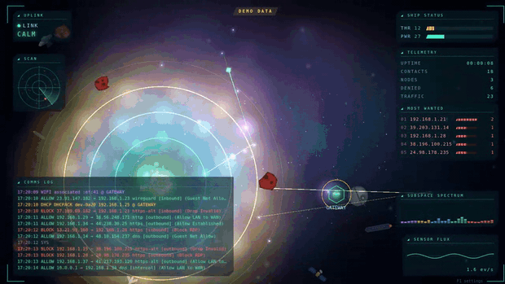

# pewpew — Orbital Command

**Your UniFi network as a living space battle.** A real-time, browser-based
"orbital command" visualizer + generative soundtrack for UniFi gateway/AP
syslog. Every firewall hit, DNS lookup, DHCP lease and Wi-Fi (dis)connect
becomes something on screen — lasers, crystals, incoming asteroids blasted by
defensive lasers — and everything you hear is synthesized live in the browser
from *your* traffic. No database, no cloud, no recordings: pure eye candy that
never touches the network itself.


Full 42s showreel with sound — calm cruise → the F1 config tour → full storm:
**[docs/demo.mp4](docs/demo.mp4)** · Screenshots: [hero](docs/hero.png) ·
[storm](docs/storm.png) · [settings](docs/panel.png) · [debug](docs/debug.png)

## Highlights

- **Living scene** (PixiJS v8) — an orbital station at the center of your
  network; hosts drift in as stars and grow into constellations, blocked
  inbound traffic becomes asteroids the station shoots down, and the whole
  thing rides a parallax nebula.
- **Generative soundtrack** — a 4-song "band" that listens to your traffic and
  plays it back: set-list rotation, song structure, tension & release — every
  note synthesized live with the WebAudio API. **No audio files anywhere.**
- **Mixable, layered audio** — additive **Melody / Devices / Noise** layers,
  each with per-event *volume* **and** *gate* controls, plus reverb, echo and a
  music-bed balance. All live in the F1 panel (below).
- **Colour system** — a fixed event colour-law (block=red, allow=green…) so the
  picture stays readable, *plus* a 48-hue host-mesh you can reskin
  (spectrum / event-law / mono / warm / cool) with a global hue-shift & intensity.
- **Runs on anything** — quality presets (Low / Medium / High / Ultra) with an
  **Auto** mode that sizes the scene to the viewing device, from a gaming PC
  down to a Raspberry Pi 5 kiosk. High is the full classic look.
- **Zero footprint** — syslog parsed in RAM and fanned out over WebSocket;
  nothing written to disk, no cloud, no accounts, no telemetry.

## See it right now (no hardware needed)

**[Browser demo](https://scratchhax.github.io/pewpew/)** ·
**[Looping showreel](https://scratchhax.github.io/pewpew/?showreel=1)**
(synthetic traffic, redeployed on every change to `web/` on `main`).

```bash
cd web && npm install && npm run dev
open http://localhost:5173/?demo=1&showreel=1
```

`?demo=1` runs a fully synthetic event generator (fake IPs/MACs/hosts —
nothing real), `showreel=1` scripts a 60s arc: calm cruise → traffic build →
**hurricane** → cooldown. Click once to wake the audio engine (browser autoplay
policy). Press **F1** any time to open the settings panel. See
[URL params](#url-params) for dialing the intensity by hand.

### GitHub Pages demo

The workflow in `.github/workflows/pages.yml` publishes the demo whenever
`web/` or the workflow changes on `main` (or run **Deploy demo to GitHub
Pages** from the Actions tab). On a fork, first select **GitHub Actions** as
the source under **Settings → Pages → Build and deployment**.

The Pages build always uses synthetic traffic, including when opened without
URL parameters, and needs no relay. Add `?showreel=1` for the looping storm
sequence or `?rate=40&block=65` to tune traffic. Click to enable sound; press
**F1** for settings. Relative asset URLs support repository paths and custom
domains. Forks use their own GitHub Pages URL.

Preview the same build locally:

```bash
cd web
npm ci
npm run build:demo
npm run preview
```

The regular `npm run build` still connects to the relay by default.

## How it works

```
UDM/UDR ──syslog UDP:5514──► relay (Python) ──JSON over WebSocket──► browser
                                │                                      :8080
                                └── also serves the built viewer: the default
                                    theme at /, every theme at /<theme>/
```

- `relay/` — Python 3.10+ aiohttp server. Parses syslog with the vendored
  [UniFi-Insights-Plus](https://github.com/jmasarweh/UniFi-Insights-Plus)
  parsers (DB/policy deps stripped), broadcasts every event to all browsers,
  replays the last 500 events to each new tab. Regex drop-list filters the
  known UDM/AP log spam. `--demo` generates fake events server-side too.
- `web/` — Vite + TypeScript + [PixiJS v8](https://pixijs.com/). Everything
  (starfield, ships, lasers, particles, the entire audio synth) is generated
  procedurally — zero image or audio assets.
- `deploy/` — systemd unit + kiosk autostart entry (built to run fullscreen
  on a Raspberry Pi, but any Chromium/Chrome/Firefox will do).

### Viewer architecture: core + themes

The relay knows nothing about how events look, and the viewer is split the
same way: a shared **core** and a **theme** that only draws. Orbital Command
(`web/src/themes/scifi/`) is the first theme.

| Core (`web/src/*`) | Theme (`web/src/themes/<id>/`) |
|--------------------|--------------------------------|
| relay feed + demo generator (`ws.ts`) | its renderer (PixiJS for sci-fi) and scene |
| event classification (`events.ts`): allow / block / threat / dns / dhcp / wifi / system, direction, Wi-Fi outcome (joined / bad / other) | what each classified event becomes on screen |
| sim state + weather (`state.ts`), per-flow visual throttle (`throttle.ts`) | which effects are worth showing, on-screen caps, camera |
| HUD, comms log, F1 panel shell, audio engine | Scene tab toggles, colour scheme, audio cues for effects it shows |
| quality presets, auto tuner, frame loop + FPS cap (`perf.ts`, `loop.ts`) | scene budgets per quality tier |
| boot + event pipeline (`app.ts`), theme selection (`themes/registry.ts`) | `Theme` object as the default export (`theme.ts` is the contract) |

Per event, the core logs it to the HUD, feeds the noise gate and sim state,
then hands the theme a `SceneEvent`. The theme turns it into visuals, asking
the shared throttle before drawing repeated flows. Each frame the core
advances time (sim speed, bullet-time, FPS cap), computes the anti burn-in
drift, and calls the theme's `frame()`. All settings live in one saved object,
so HUD and audio preferences carry across themes.

### Choosing a theme

One relay serves every theme in the build, so different screens can show
different themes at the same time:

| URL | Theme |
|-----|-------|
| `http://<relay-host>:8080/` | the relay's `default_theme` (`relay.yaml`, default `scifi`) |
| `http://<relay-host>:8080/<theme>/` | that theme, e.g. `/scifi/` (unknown themes are a 404) |
| any URL + `?theme=<theme>` | that theme (useful on the Pages demo) |

The viewer picks, in order: the theme named in the URL path, `?theme=`, the
relay's `default_theme` from `GET /config.json`, then `scifi`. Each theme is
built as its own chunk, so a screen only downloads the theme it shows. Other
URL params combine as usual, e.g. `/scifi/?quality=low`.

To add a theme: create `web/src/themes/<id>/index.ts` with a default export
of a `Theme` (defaults, per-tier budgets, panel controls, `create()`). It is
picked up automatically: the viewer registry finds it, the build writes
`dist/<id>/index.html`, and the relay serves it at `/<id>/`.

## Run against your own network

1. Start the relay:

   ```bash
   cd relay && python3 -m venv .venv && .venv/bin/pip install -r requirements.txt
   .venv/bin/python pewpew_relay.py
   ```

2. UniFi OS console: **Settings → Advanced → Remote Syslog → host = this
   machine, port = 5514**. Enable logging on the firewall zones/rules you
   want to see.

3. Open `http://<relay-host>:8080`. Adjust `wan_interfaces` in
   `relay/relay.yaml` if inbound/outbound classification looks wrong
   (`ppp0` for DSL, `eth8`–`eth10` on many UDM/UDR setups). The `IN=` /
   `OUT=` fields of your gateway's firewall syslog lines show which interface
   is the WAN.

4. Production build: `cd web && npm run build` — the relay serves `dist/`
   automatically (with `Cache-Control: no-cache`, so refreshes always get the
   current build).

## The visual language

Colors of every effect match the comms-log lines verbatim:

| Event    | Color      | On screen |
|----------|------------|-----------|
| allow    | green      | crystals core↔device + star-to-star links, inner ring |
| block    | red        | inbound asteroid → station laser intercept, shake + flash |
| dns      | blue       | blue laser client→station ("the resolver is you"), 2nd ring |
| dhcp     | yellow     | a labelled planet (the client's hostname) drifts across the field, the logging AP core ripples yellow, 3rd ring |
| wifi     | purple     | client **joins** (associated / authenticated) send a crystal AP core → station; **leaves** and failures (deauth, disassoc, rejects) fire a laser station → AP core; a faint event star marks each one; 4th ring |
| system   | grey       | grey shockwave from the station |
| threat   | amber      | IDS/IPS detection (Enhanced/CyberSecure tier) — an attack **rocket** that burns in on an evasive, weaving path from a random bearing, gets shot down close to the station with an amber detonation, and turns the core **red** while any rocket is alive; carries a MAC, no source IP |

Traffic volume drives weather: **STORM** at ≥300 events/30s and **HURRICANE** at
≥1200 — the weather readout turns amber (STORM) or red (HURRICANE), the
station flares, and the field fills with debris and intercept fire.
IPs you talk to a lot grow into constellations; blocked destinations rack up
on the **MOST WANTED** board. The fleet drifting through the scene is a
hand-drawn (procedurally generated) honor squad.

## The audio engine

All sound is synthesized in the browser with the WebAudio API — there is no
audio file anywhere in this repo. Think of it as a small band that listens to
your network:

- **Generative set list** — a 4-song bank of distinct melodies (arpeggios,
  riffs, cascades, wanderings) rotated every 75–165s, each with its own bass
  groove, lead timbre and register. Mutations and key slides evolve each song
  in between.
- **Song structure** — the band moves through intro / verse / chorus / bridge
  / outro, driven by how heavy your traffic is. Block *pressure* (ratio of
  denied traffic) builds tension; a lull after a storm resolves it.
- **Device voices** — every MAC/IP gets a hash-derived musical identity, so
  your laptop plays "its" notes; overly chatty devices get fame-limited.
- **Additive layers** (F1) — three sound sources you mix in and out, they sum:
  **Melody** (the generative band), **Devices** (gated per-event hits — block
  kick, DNS sparkle, WiFi glide, DHCP chord, allow data-tick — plus the per-host
  identity notes), and **Noise** (a chaos texture fired 1:1 on raw events).
- **Volume vs gate** (F1) — every event type has its own *volume* (how loud)
  and its own *gate* (how often it passes, 0 = choked off → 1 = every hit).
  The **Noise gate** replaces the old NOISE MODE: 0 is silent, 1 is full chaos
  (every raw event, no dedupe, scheduled sample-accurately through a pacing
  queue so bursts stay audible).
- **Under attack** — while an IDS/IPS threat rocket is on screen, a sustained
  menace bed swells in: detuned sub-bass saws (root + tritone) through a slowly
  wobbling filter and a fast tremolo pulse, with a periodic target-lock ping on
  top, all fed through reverb and echo. It rides threat *presence* — it rises as
  the attack closes and powers down once the last rocket is shot down. Gated and
  levelled by the Threat volume/gate sliders in F1.
- Master volume, reverb, echo, a music-bed-vs-hits balance, and a device-voice
  mix — all in F1.

## F1 settings panel

Press **F1** for a tabbed control surface — **Scene / HUD / Audio / Colour /
System**. Changes apply live and persist to localStorage, except antialias
and GPU power, which the renderer reads at startup (the panel offers
*Apply & reload*).

| Tab | What's in it |
|-----|--------------|
| **Scene** | starfield · nebula · dust · ambient ships · DHCP planets · event stars · asteroids · attack rockets · crystals · IP constellations · ring objects (dots orbiting the event rings) · AP cores · screen shake |
| **HUD** | uplink · ship-status bars · telemetry · most-wanted · comms log · sensor flux · subspace spectrum · radar · scanlines |
| **Audio** | additive Melody / Devices layers, per-event volume + per-event gate, the noise (chaos) gate, master / reverb / echo / music-bed, device mix |
| **Colour** | host-mesh scheme (spectrum / event-law / mono / warm / cool) + a global hue-shift & intensity that sweeps the mesh, nebula and HUD accent |
| **System** | quality preset (auto / low / medium / high / ultra / custom) · render scale · FPS cap · particle, star density, nebula, dust, effect-detail budgets · IP star and event star caps · antialias + GPU power (reload) · simulation speed · reset-to-defaults |

### Audio: volume vs gate

Two knobs per event type, and they do very different jobs:

- **Volume** — how *loud* that event's sound is.
- **Gate** — how *often* it passes (0 = choked off → 1 = every hit). Gates are
  densities: they thin a busy stream without changing its level.
- **Noise (chaos) gate** — replaces the old NOISE MODE. Fires a noise burst on
  a fraction of raw events; 0 = off, 1 = every single event (full chaos).

Flip the **Melody** and **Devices** toggles to add or subtract whole layers —
everything sums, so you can run melody-only, devices-only, or stack both under
noise. (The pitched impacts fire once per sequencer step, so they're a per-step
summary; the noise gate fires 1:1 on raw events — that's why noise ≠ a wide-open
gate.)

### Performance & quality

The relay never renders anything: every browser that opens the page draws the
scene on its own GPU. So how smooth it runs depends on the *viewing* device,
and a quality tier bundles every knob that trades looks for frame time.

| Setting | Low | Medium | **High** | Ultra |
|---------|-----|--------|----------|-------|
| Render scale | 0.6 | 0.8 | 1.0 | device pixel ratio (≤2) |
| FPS cap | 30 | 60 | none | none |
| Antialias | off | off | off | on |
| GPU power preference | low-power | browser default | low-power | high-performance |
| Particles | 800 | 2000 | 4000 | 8000 |
| Star density | 0.4 | 0.7 | 1.0 | 1.5 |
| Nebula clouds | 3 | 5 | 7 | 9 |
| Dust motes | 20 | 45 | 70 | 140 |
| Effect detail (station aura, crystal trails) | 0.5 | 0.75 | 1.0 | 1.0 |
| IP stars / event stars | 60 / 100 | 100 / 180 | 140 / 260 | 200 / 400 |

- **High** is exactly how the scene looked before presets existed.
- **Auto** (the default) guesses a tier when the page loads (Pi / phone GPUs,
  software renderers and browsers without WebGL start at Low; touch devices,
  ≤4-core or ≤4 GB machines and Intel HD/UHD integrated graphics at Medium;
  everything else at High), then watches the real frame rate. If it
  stays under ~75% of target for 5 seconds, it drops one tier. It only ever
  steps **down**, so it can't flap; a reload starts from the guess again. The
  System tab shows which tier Auto is running and why.
- Moving any individual value switches the preset to **Custom** and keeps your
  numbers.
- **Render scale** trades sharpness for GPU fill: 0.6 draws about a third of
  the pixels of 1.0. The HTML HUD and page compositing are *not* scaled, so on
  a small board driving a big display the browser itself is often the ceiling
  (see the measurements below).
- **Antialias** and **GPU power** are read once when the renderer starts; the
  panel offers *Apply & reload* when you change them.
- Pin a device from the URL instead of the panel (handy for a kiosk with no
  keyboard): `?quality=low`, `?scale=0.6`, `?fps=30`. URL values apply to that
  page load only and are never saved. `?debug=1` shows FPS, worst frame time,
  the active tier and render scale.
- Settings saved before presets existed keep a hand-tuned particle budget as
  **Custom**; untouched ones move to **Auto**.


**Measured on a Raspberry Pi Compute Module 5** (Chromium kiosk, 2560×1440
@ 75Hz, heavy demo traffic `?demo=1&rate=40&block=65`):

| Tier | Canvas | FPS |
|------|--------|-----|
| High | 2560×1440 | 17.7 |
| Medium | 2048×1152 | 20.9 |
| Low | 1536×864 | 23.6 (25.4 in normal traffic) |

Auto guessed Low on its own ("embedded GPU"). Forced to start at High, it
stepped to Medium after 9s and Low after 18s. The scene logic costs ~4ms and
the render calls ~8ms per frame; the rest is Chromium painting and compositing
a 1440p page: hiding the HUD alone reached 33fps, and hiding the whole WebGL
scene only 27fps. On a board like this, running the display at 1080p is likely
to help more than any in-page setting.

These numbers predate the core/theme split. After it, the same kiosk ran Auto
(Low) at 26.4fps on live STORM traffic, in line with the numbers above.




## URL params

| Param | Effect |
|-------|--------|
| `/<theme>/` (path) | show that theme, e.g. `/scifi/` (see [Choosing a theme](#choosing-a-theme)) |
| `?theme=scifi` | show that theme on any URL |
| `?demo=1` | synthetic event generator, no relay needed |
| `?demo=1&showreel=1` | scripted 60s calm→build→hurricane→cooldown arc, looping |
| `?demo=1&rate=40` | demo at ~40 events/sec |
| `?demo=1&rate=40&block=65` | …with 65% of firewall hits blocked |
| `?hosts=Router,Kitchen-AP` | demo hostnames |
| `?quality=low` | pin the quality tier (`auto` / `low` / `medium` / `high` / `ultra`) for this load |
| `?scale=0.6` | pin the render scale (0.25–2) for this load |
| `?fps=30` | pin the FPS cap (`0` = uncapped) for this load |
| `?debug=1` | perf/audio overlay (FPS, worst frame, quality tier, render scale, scene nodes, events/s, scheduler queue, voices alive, RMS) |


## Health & diagnostics

- `GET /healthz` — per-host syslog line counters, WS clients, event counters
- `GET /drops` — which drop-pattern regexes are catching what
- `GET /config.json` — `default_theme` and the themes installed in the build
- APs/gateway stop logging for 1–3 minutes after a relay restart — that's the
  UniFi log-forwarder's backoff, it reconnects itself.

## Privacy

- Everything runs on your LAN. No outbound connections, no telemetry,
  no analytics, no accounts.
- Syslog is parsed in RAM and fanned out over WebSocket; nothing is written
  to disk. Settings live in your browser's localStorage.
- Demo mode generates fake IPs/MACs/hostnames — safe to screenshot and share.

## Troubleshooting

- **No sound** — browsers require a click/keypress before audio can start.
  One click, then the engine wakes up.
- **Everything looks soft/wrong after an update** — hard-refresh (Ctrl+Shift+R);
  the relay sends no-cache headers, but be paranoid.
- **Wrong direction classification** — fix `wan_interfaces` in `relay.yaml`.
- **Weak GPU / choppy** — Auto should settle on its own within ~30s. If not,
  pick **Low** in F1 → System or add `?quality=low`, then lower **Render
  scale** further. `?debug=1` shows the FPS you're actually getting. On a Pi
  driving a 1440p/4K screen, a 1080p display mode helps most.
- **Looks soft** — you're on a lower tier or render scale; F1 → System shows
  which. Pick **High** (or **Ultra** on a HiDPI screen) if the GPU can take it.
- **Windows LAN IP changed and the viewer is blank** — it's pointing at the
  old relay IP; open the new one.

## Deploying (Raspberry Pi kiosk)

```bash
sudo cp deploy/pewpew-relay.service /etc/systemd/system/   # adjust paths/user
sudo systemctl enable --now pewpew-relay
cp deploy/pewpew-kiosk.desktop ~/.config/autostart/        # fullscreen chromium
```

The relay serves `web/dist/`, which needs Node 18+ to build. A Pi doesn't
need Node: build on any machine (`cd web && npm ci && npm run build`) and
copy `web/dist/` into the relay's checkout, e.g.
`rsync -a --delete web/dist/ pi@<relay-host>:pewpew-ui/web/dist/`. Static files
update without a restart; restart `pewpew-relay` only when `relay/` changes
(UniFi devices then take 1–3 minutes to resume logging).

The kiosk entry opens `?quality=low`, the starting point for a Pi 5. Edit the URL
in `pewpew-kiosk.desktop` to try `medium`, to point a kiosk at a relay on
another host (e.g. `http://192.168.1.5:8080/?quality=low`), or to pin a theme
regardless of the relay's default (e.g. `http://192.168.1.5:8080/scifi/?quality=low`).

## Credits

- Syslog parsing: vendored from
  [UniFi-Insights-Plus](https://github.com/jmasarweh/UniFi-Insights-Plus)
  (MIT), stripped of database dependencies.
- [PixiJS v8](https://pixijs.com/) for the renderer.
- Every texture, sound and melody: generated in code.
- IDS/IPS threat rendering (the amber attack rockets, red "under-attack" core
  and the sustained threat audio bed) grew out of the CEF security-event parser
  idea and initial implementation by [natechit](https://github.com/natechit).

## License

[MIT](LICENSE)
